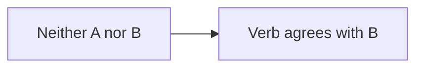

# Quiz extension for Yellow

Version **0.9.1-custom**

Multiple-choice and true/false quizzes for Yellow, written as plain text files and placed on a page with one shortcut. Students who pass can create a PDF certificate, which is recorded on the server so it can be verified and reprinted.

Built for **formative, process-oriented, low-stakes assessment**: unlimited retakes, nothing stored about students who do not create a certificate, no database, and a light server load.

## Highlights

- Start popup: questions and time start only after **Start quiz**
- Multiple choice and true/false, categories with mastery per category, score always 0–100
- Optional correction for guessing, time limit with a top timer, open/close schedule
- Every question must be answered; automatic sending when time is up or after three page leaves
- Copy, print and page-leave protection; answer key never sent to the browser
- Result kept only in the student's browser: shared result links reveal nothing
- PDF certificates (one per person per quiz, highest score kept), reprint by number, CSV records, leaderboard
- Images, audio, video, YouTube, Vimeo, iframes, Mermaid diagrams and Chart.js charts
- Theme-safe styling, phone layout, reduced-motion support

## Quick start

1. Copy `quiz.php`, `quiz.js` and `quiz.css` to `system/workers/`.
2. Save `media/quiz/my-quiz.txt`:

```
= time: 10, pass: 80
! Read each question carefully.
1. The capital of France is ___. | Paris | Lyon | Nice | Lille
2. Water boils at 100 °C at sea level. | 1
```

3. Put `[quiz my-quiz.txt]` on a Yellow page and open it.

Set your time zone in `system/extensions/yellow-system.ini`, for example `CoreTimezone: Asia/Jakarta`.

## Contents

1. [Overview](#overview)
2. [Requirements](#requirements)
3. [Installation](#installation)
4. [Site Settings (`yellow-system.ini`)](#site-settings-yellow-systemini)
5. [Shortcuts](#shortcuts)
6. [Quiz Identity](#quiz-identity)
7. [Writing a Quiz File](#writing-a-quiz-file)
8. [Quiz Settings (the `=` Line)](#quiz-settings-the--line)
9. [Scoring](#scoring)
10. [The Start Popup](#the-start-popup)
11. [Taking the Quiz](#taking-the-quiz)
12. [Leaving the Page](#leaving-the-page)
13. [Sending the Answers](#sending-the-answers)
14. [The Result Page](#the-result-page)
15. [Schedule (Open and Close)](#schedule-open-and-close)
16. [Certificates](#certificates)
17. [Reprinting Certificates](#reprinting-certificates)
18. [Certificate Records (CSV)](#certificate-records-csv)
19. [Leaderboard](#leaderboard)
20. [Media, Diagrams and Charts](#media-diagrams-and-charts)
21. [Stored Data and Privacy](#stored-data-and-privacy)
22. [Security and Anti-Cheating](#security-and-anti-cheating)
23. [Appearance](#appearance)
24. [Languages and Texts](#languages-and-texts)
25. [Limits and Fixed Values](#limits-and-fixed-values)
26. [Technical Reference](#technical-reference)
27. [Troubleshooting](#troubleshooting)
28. [Appendix: All Texts](#appendix-all-texts)

---

## Overview

| Feature | Description | See |
|---|---|---|
| Start popup | A quiz opens with a popup describing it. Questions and time start only after **Start quiz** | [The Start Popup](#the-start-popup) |
| Question types | Multiple choice with any number of options, and true/false | [Writing a Quiz File](#writing-a-quiz-file) |
| Categories | Questions grouped with `@ Name`; mastery is calculated per category | [Writing a Quiz File](#writing-a-quiz-file), [Scoring](#scoring) |
| Score 0–100 | Always scaled to 0–100, whatever the number of questions | [Scoring](#scoring) |
| Correction for guessing | Optional penalty for wrong answers; empty answers are not penalised | [Quiz Settings (the `=` Line)](#quiz-settings-the--line), [Scoring](#scoring) |
| Timer | Light ribbon fixed at the top of the screen that grows warmer as time runs out | [Taking the Quiz](#taking-the-quiz) |
| Required answers | Every question must be answered before sending, except for automatic sending | [Sending the Answers](#sending-the-answers) |
| Leave detection | Leaving the page for 10 seconds or more is counted; the third time sends the answers | [Leaving the Page](#leaving-the-page) |
| Copy and print protection | Right click, selection, copying, dragging and shortcuts are blocked; printing gives a white page with the site name | [Security and Anti-Cheating](#security-and-anti-cheating) |
| Answer review | Own answers marked, answer key, or result card only | [Quiz Settings (the `=` Line)](#quiz-settings-the--line), [The Result Page](#the-result-page) |
| Schedule | A quiz can open and close at a date and time | [Schedule (Open and Close)](#schedule-open-and-close) |
| Certificates | PDF certificate for students who pass; one per person per quiz, highest score kept | [Certificates](#certificates) |
| Reprint | By the 10-character certificate number, from any device | [Reprinting Certificates](#reprinting-certificates) |
| Records | One CSV file per quiz with certificate holders, device code and time taken | [Certificate Records (CSV)](#certificate-records-csv) |
| Leaderboard | Ranking of one quiz on any page | [Leaderboard](#leaderboard) |
| Media | Images, audio, video, YouTube, Vimeo, iframes, Mermaid diagrams, Chart.js charts | [Media, Diagrams and Charts](#media-diagrams-and-charts) |
| Theme-safe styling | The quiz is protected against theme styles | [Appearance](#appearance) |
| Light on the server | No database; files are written only when a certificate is created | [Stored Data and Privacy](#stored-data-and-privacy) |

---

## Requirements

| Item | Requirement |
|---|---|
| CMS | Datenstrom Yellow (tested with Yellow 1.0.3) |
| PHP | Must be able to write to `system/workers/` (secret key and data folder). Tested with PHP 8.3 |
| Browser | JavaScript enabled. Without JavaScript the quiz cannot be taken |

---

## Installation

### Files

| File | Location |
|---|---|
| `quiz.php` | `system/workers/quiz.php` |
| `quiz.js` | `system/workers/quiz.js` |
| `quiz.css` | `system/workers/quiz.css` |

`quiz.js` and `quiz.css` are added to the `<head>` of **every page** of the site, from the Yellow asset location (`CoreServerBase` + `CoreAssetLocation`). Their addresses end with `?v=0.9.1-custom.11`, so browsers load the new files after an update instead of old copies from their cache.

### Files created automatically

| File or folder | Location | Content |
|---|---|---|
| `quiz-secret.php` | `system/workers/` | Random 256-bit secret key (64 hexadecimal characters). Created once, the first time a quiz page is opened, unless `QuizSecret` is set |
| `quiz-data/` | `system/workers/quiz-data/` (default) | Certificate records |
| `quiz-data/.htaccess` | inside the data folder | Denies web access on Apache |
| `quiz-data/index.html` | inside the data folder | Empty file; also the lock file for writing and the time marker of the automatic clean-up |
| `<quiz>-<code>.csv` | inside the data folder | One record file per quiz, created with its first certificate |

**Do not change or delete `quiz-secret.php` while quizzes are in use.** A new key makes every running attempt and every result stored in browsers invalid. Recorded certificates stay valid and can still be reprinted.

### nginx

`.htaccess` only works on Apache. On nginx, block the data folder and the key in the server configuration:

```nginx
location ~ ^/system/workers/(quiz-data/|quiz-secret\.php) {
    deny all;
    return 404;
}
```

If `QuizDataDirectory` points elsewhere, block that folder too.

### First quiz

1. Save a quiz file, for example `media/quiz/my-quiz.txt`:

```
= time: 10, pass: 80
! Read each question carefully.
1. The capital of France is ___. | Paris | Lyon | Nice | Lille
2. Water boils at 100 °C at sea level. | 1
```

2. Write this in a Yellow page:

```
[quiz my-quiz.txt]
```

3. Open the page. The start popup appears.

---

## Site Settings (`yellow-system.ini`)

Settings are written in `system/extensions/yellow-system.ini` as `Name: value`. Missing settings use their default.

### Quiz settings

| Setting | Default | Allowed values | Meaning |
|---|---|---|---|
| `QuizDirectory` | `media/quiz/` | Folder ending with `/` | Folder of the quiz files. `[quiz file.txt]` looks for the file in this folder. Files outside it are always refused |
| `QuizPass` | empty (= 80) | `0`–`100` | Default pass mark for quizzes without their own `pass`. `0` means every attempt sent in time may get a certificate. Empty, non-numeric or out-of-range values mean 80 |
| `QuizCertificateKeepDays` | `30` | `0`, or a number of days | How long certificate records are kept. After that, records are removed and cannot be reprinted. `0` keeps them forever. Fractions are rounded up (minimum 1 day). Empty, negative or non-numeric values mean 30. A change applies to all records, including existing ones |
| `QuizSecret` | empty | Text of at least 16 characters | Own secret key. When empty or shorter than 16 characters, the generated `quiz-secret.php` is used. Usually not needed; useful when PHP cannot write to `system/workers/` or the site runs on several servers |
| `QuizDataDirectory` | empty (= `system/workers/quiz-data/`) | Folder | Where certificate records are stored. Created automatically. Must be writable by PHP and closed to web access |
| `QuizMermaidUrl` | `https://cdn.jsdelivr.net/npm/mermaid@11/dist/mermaid.min.js` | Address of a JavaScript file | Mermaid library for diagrams. Loaded only by quizzes with a ` ```mermaid ` block, and only when the page does not already have Mermaid |
| `QuizChartUrl` | `https://cdn.jsdelivr.net/npm/chart.js@4/dist/chart.umd.min.js` | Address of a JavaScript file | Chart.js library for charts. Loaded only by quizzes with a ` ```chartjs ` block, and only when the page does not already have Chart.js |

### Yellow settings used by the quiz

| Setting | Used for |
|---|---|
| `CoreTimezone` | Time zone of `open` and `close`, of the times in the closing banner, and of the date stored with each certificate. **Set it correctly**, for example `CoreTimezone: Asia/Jakarta`. With `UTC`, "08:00" means 15:00 in Jakarta |
| `Sitename` | Printed at the top of the certificate and around its stamp; printed alone when a quiz page is printed |
| `Language` (site or page) | Language of the quiz texts on the question and result pages (section [Languages and Texts](#languages-and-texts)) |
| `CoreServerBase`, `CoreAssetLocation` | Where `quiz.js` and `quiz.css` are loaded from |

### Recommended settings

```ini
CoreTimezone: Asia/Jakarta
QuizPass: 80
QuizCertificateKeepDays: 180
```

`QuizCertificateKeepDays: 180` (or `0`) is recommended when certificates are collected over a semester. With 30 days, certificates from the beginning of the semester are removed before it ends.

---

## Shortcuts

### `[quiz]`: show a quiz

```
[quiz file.txt]
[quiz file.txt "Quiz title"]
[quiz folder/file.txt]
```

| Part | Required | Meaning |
|---|---|---|
| `file.txt` | yes | Quiz file inside `QuizDirectory`, subfolders allowed. Must start with a letter or digit and may contain only letters, digits, `_`, `-`, `.` and `/`. `..` is refused |
| `"Quiz title"` | no | Title shown in the popup and printed on the certificate. Without it, or with `-`, the page title (`Title`) is used |

| Situation | Result |
|---|---|
| File not found, name not allowed, or no valid question | The shortcut shows nothing |
| More than 300 questions | A notice asks to split the quiz |
| Secret key cannot be created | A notice explains that the quiz cannot be used yet |

Pages with a quiz are sent with `Cache-Control: no-store, max-age=0`, so browsers and proxies never show an old copy.

### `[quizcertificate]`: reprint page

```
[quizcertificate]
```

No arguments. Shows a form to reprint a certificate by its number (section [Reprinting Certificates](#reprinting-certificates)). The same form is inside every quiz popup (**Reprint it**), so this page is optional.

### `[quizleaderboard]`: leaderboard

```
[quizleaderboard file.txt]
[quizleaderboard file.txt 10]
```

| Part | Required | Meaning |
|---|---|---|
| `file.txt` | yes | The quiz file, written as in `[quiz ...]` |
| a number | no | Show only this many rows from the top. Without a number, all rows are shown |

A file name that is not allowed shows nothing. Details in section [Leaderboard](#leaderboard).

---

## Quiz Identity

Every quiz has an identity made from **the page address + the quiz file name**.

| Situation | Effect |
|---|---|
| The same file on two pages | Two separate quizzes: separate attempts, results and record files. The leaderboard combines them |
| The page is moved or renamed, or the file is renamed | It becomes a new quiz: running attempts and stored results no longer open, and new certificates go to a new record file. Existing certificates stay reprintable |

Decide the page address and file name before a quiz is used.

---

## Writing a Quiz File

A quiz file is a UTF-8 text file in `QuizDirectory`. The extension `.txt` is recommended.

### Example

```
= time: 20, penalty: 1, shuffle: 1, review: card, pass: 80, minimum: 60, open: 2026-10-01 00:00, close: 2027-12-31 23:59
! This quiz checks subject–verb agreement at B2 level.
! Wrong answers lower your score, so do not guess blindly.
# Concord: Subject–Verb Agreement

@ Tricky Subjects
Some subjects look plural but take a singular verb.
1. The number of applicants ___ increased this year. | has | have | are | were
2. A number of students ___ complained. | have | has | is | was
- Mathematics is a plural noun. | 0

@ Phrases between Subject and Verb
3. The quality of the essays ___ improved. | has | have | are | were
+ "Here are the documents" is correct. | 1
```

### Line types

The first character of a line decides its type.

| Line starts with | Type | Meaning |
|---|---|---|
| `=` | Settings | Quiz settings (section [Quiz Settings (the `=` Line)](#quiz-settings-the--line)). Several `=` lines are combined; a later value replaces an earlier one |
| `!` | Popup instruction | One instruction line in the start popup. Supports text formatting ([Writing a Quiz File](#writing-a-quiz-file)). A line starting with `![` is media, not an instruction |
| `@` | Category | Starts a category, e.g. `@ Tricky Subjects`. A `@` line without a name is ignored |
| `1.`, `2.`, … | Question | Numbers need not be in order; questions are numbered again on screen |
| `-`, `+`, `*` followed by a space | Question | A question without a number |
| `#` to `######` | Heading | Heading inside the quiz (`#` largest, up to six levels) |
| ` ``` ` | Block | Mermaid diagram, Chart.js chart or code block (section [Media, Diagrams and Charts](#media-diagrams-and-charts)) |
| `<iframe`, `<audio`, `<video` | Embed | Pasted embed code (section [Media, Diagrams and Charts](#media-diagrams-and-charts)) |
| anything else | Text | A paragraph |
| empty line | — | Ignored |

A line is a question only when it starts with a question marker **and** contains `|`. A line starting with `-` without `|` is a paragraph.

### Multiple-choice questions

```
1. Question text | correct answer | distractor | distractor | distractor
```

- Parts are separated by `|`. The character `|` cannot be used inside a question or option.
- **The first option after the question is always the correct answer.**
- On screen, options are **always shuffled** for every attempt, so the position of the correct answer cannot be predicted.
- Any number of options; at least two. Four or five are recommended.
- Option letters (A, B, C…) are added automatically.

### True/false questions

```
- A true statement. | 1
- A false statement. | 0
```

| Value after `\|` | Meaning | Correct answer |
|---|---|---|
| `1` | The statement is true | True |
| `0` | The statement is false | False |

True is always shown first and False second (never shuffled). The words come from the texts `QuizTrue` and `QuizFalse` in the page language (for example "Benar" and "Salah" in Indonesian).

### Categories

- `@ Name` starts a category. All questions below it belong to it until the next `@` line.
- Categories keep their order on screen. Questions are numbered continuously across categories.
- A category without questions is not shown.
- Without any `@` line, all questions form one unnamed group, and the result shows one mastery figure instead of a list of categories.
- Questions before the first `@` line in a file that also has named categories form the category **General**.
- The category name is shown as a heading (H2) above its questions, in the popup ("Parts"), on the result card, on the certificate and in the record file.

### Text formatting

Works in questions, options, paragraphs, headings and popup instructions.

| Write | Result |
|---|---|
| `**bold**` | **bold** |
| `*italic*` | *italic* |
| `[text](https://example.com)` | Link (addresses starting with `http://` or `https://`) |
| `https://example.com` | Automatic link |
| `` | Image, audio, video, YouTube or Vimeo (section [Media, Diagrams and Charts](#media-diagrams-and-charts)) |
| `\n` | Line break |
| `\\` | A backslash |

All other HTML is shown as text and never executed (only `<iframe>`, `<audio>` and `<video>` at the start of a line are embeds).

### Where text and media appear

| Position in the file | Position on screen |
|---|---|
| Before the first question and before the first `@` | Opening section, above all categories |
| Right after `@ Name`, before its first question | Introduction of that category, under its heading |
| Between two questions | **Travels with the next question.** When questions are shuffled, it stays directly above that question. Use it for a reading text, audio or video that belongs to one question |
| After the last question of a category | End of that category |

**Every category is one block.** Its heading, text, media, diagrams and charts always stay inside it. The same text and media are also shown in the answer review.

### Limit

A quiz may have at most **300 questions**.

---

## Quiz Settings (the `=` Line)

### Writing settings

```
= time: 20, penalty: 1, shuffle: 1, review: card, pass: 80, minimum: 60, open: 2026-10-01 00:00, close: 2027-12-31 23:59
```

- Each setting is `name: value`; settings are separated by commas, in any order.
- Setting names are not case-sensitive.
- Missing settings use their default.
- **Invalid values are ignored without a message**, and the default is used.

### All settings

| Setting | Default | Allowed values |
|---|---|---|
| `time` | Number of questions (1 minute per question) | `0`, or a whole number of minutes; values above 10080 become 10080 |
| `penalty` | `0` | `0`, `1` |
| `shuffle` | `1` | `0`, `1` |
| `review` | `0` | `0`, `1`, `card` |
| `pass` | `QuizPass` (80) | `0`–`100` |
| `minimum` | off | `0`–`100` |
| `open` | none | Date and time |
| `close` | none | Date and time |

### `time`: time limit

| Value | Meaning |
|---|---|
| not set | 1 minute per question (20 questions = 20 minutes) |
| `0` | No time limit; no timer ribbon |
| `1` to `10080` | Time limit in minutes (10080 = 7 days) |
| above `10080` (up to 5 digits) | Treated as `10080` |
| anything else (`twenty`, `-5`, `1.5`) | Ignored: 1 minute per question |

- The time starts when **Start quiz** is pressed, not when the popup is opened.
- The time is measured by the server; the clock of the student's device does not matter.
- When the time is up, the answers are sent automatically. Questions not answered score 0.
- Answers that arrive more than **60 seconds** after the limit are **late**: the score is shown, but there is no certificate.
- An attempt stays usable for the time limit + 15 minutes; after that, opening the quiz shows the start popup again.
- A quiz without a time limit that has a closing time follows a special rule ([Schedule (Open and Close)](#schedule-open-and-close)).

### `penalty`: correction for guessing

| Value | Meaning |
|---|---|
| `0` | No penalty. Wrong and empty answers both score 0 |
| `1` | A wrong answer scores −1 ÷ (number of options − 1). An empty answer scores 0 |

See section [Scoring](#scoring).

### `shuffle`: question order

| Value | Meaning |
|---|---|
| `1` | Questions are shuffled for every attempt, **inside their category**. Categories keep the file order |
| `0` | Questions keep the file order |

Options are always shuffled, whatever this setting (true/false questions always show True first). The order of an attempt stays the same after a refresh.

### `review`: what students see after sending

| Value | Shown after sending |
|---|---|
| `0` (default) | The result card, and every question with the student's own answer marked: a right answer in green and bold, a wrong answer in red and struck through. **The correct answer of a wrong or empty question is not shown** |
| `1` | As `0`, and the correct answer of every wrong or empty question is shown in bold |
| `card` | **Only the result card**: score, mastery per category, certificate button and messages. Questions, options, answers and key are not shown |

`card` is not case-sensitive (`card`, `Card`, `CARD`). Only the exact values `0`, `1` and `card` are accepted.

### `pass`: pass mark

| Value | Meaning |
|---|---|
| not set | `QuizPass`, else 80 |
| `0` | No score requirement: every attempt sent in time may get a certificate (unless `minimum` is set) |
| `1` to `100` | Lowest score for a certificate. Decimals allowed, rounded to one decimal |

Passed when **score ≥ pass**. The score is compared after rounding to one decimal: 79.96 is shown as 80 and passes `pass: 80`.

### `minimum`: mastery required in every category

| Value | Meaning |
|---|---|
| not set or `0` | Off |
| `1` to `100` | Every category must reach at least this mastery (%) for a certificate |

Example: `pass: 80, minimum: 60`. A score of 85 with one category at 50% gives **no** certificate; the result card names the category below the minimum.

Without categories, `minimum` is merged into `pass` and the **higher** value applies. Example: `pass: 80, minimum: 90` without categories → a score of 90 is required.

### `open` and `close`: schedule

| Format | Example | Meaning |
|---|---|---|
| Date and time | `2026-10-10 08:00` | 10 October 2026, 08:00 |
| With seconds | `2026-10-10 08:00:30` | 08:00:30 |
| Date only | `2026-10-10` | 00:00 on that day |

| Written | Meaning |
|---|---|
| neither | The quiz is always open |
| only `open` | Opens at that time and never closes |
| only `close` | Open from the start; closed from that time until `close` is changed or removed |
| both | Open between the two times |

- Date as year-month-day; 24-hour time; the site time zone (`CoreTimezone`).
- Impossible dates (`2026-13-45`) and other formats are ignored.
- To reopen a closed quiz, change or remove `close`.

Behaviour in section [Schedule (Open and Close)](#schedule-open-and-close).

---

## Scoring

### Without penalty (`penalty: 0`)

| Answer | Points |
|---|---|
| Right | 1 |
| Wrong | 0 |
| Empty | 0 |

**Score = (sum of points ÷ number of questions) × 100**, rounded to one decimal.

Example: 20 questions, 17 right → 17 ÷ 20 × 100 = **85**.

### With penalty (`penalty: 1`)

| Answer | Points |
|---|---|
| Right | 1 |
| Wrong | −1 ÷ (number of options − 1) |
| Empty | 0 |

| Options | Penalty for one wrong answer |
|---|---|
| 2 (true/false) | −1 |
| 3 | −0.5 |
| 4 | −0.333… |
| 5 | −0.25 |

**Score = (sum of points ÷ number of questions) × 100**, kept between 0 and 100, rounded to one decimal.

Example: 20 questions with 4 options; 15 right, 4 wrong, 1 empty.
- Points = 15 − 4 × ⅓ = 13.667
- Score = 13.667 ÷ 20 × 100 = **68.3**
- The result card states the penalty: −6.7 points for 4 wrong answers (= 4 × ⅓ ÷ 20 × 100).

Random guessing gains nothing on average; unanswered questions are not punished.

### Mastery per category

**Mastery = (sum of points of the category's questions ÷ number of questions in the category) × 100**, with the same penalty rule, kept between 0 and 100, rounded to one decimal.

### Certificate requirement

All of these must be true:

1. the answers arrived in time (at most 60 seconds after the limit);
2. **score ≥ pass**;
3. with `minimum` and categories: **every category ≥ minimum**.

### Hint: how many more right answers

When the requirement is not met, the result card shows the **smallest number** of additional right answers needed, followed by what is missing:

> Answer 3 more questions correctly to unlock your certificate. The pass mark is 80 points. Every part needs at least 60%. Below the minimum now: Phrases (50%).

How it is calculated: first, each category below the minimum is raised with its own questions; then the pass mark is reached with the answers that gain the most. With penalty, changing a wrong answer to right gains more than answering an empty question, because the penalty disappears too.

### Number format

Scores, mastery and penalty points are shown with at most one decimal, with a dot (`68.3`, `85`).

### Verification

Scoring, mastery, penalty, the pass decision and the hint were checked on 1,000 random answer sets against an independently written reference calculation. All results were identical.

---

## The Start Popup

### What it shows

Opening a quiz page shows only the popup. The questions are not in the page yet, and the time has not started. The page behind the popup cannot be scrolled. The popup is always in English.

| Row | Content |
|---|---|
| Title | The quiz title |
| Questions | Number of questions |
| Time | "20 minutes", "1 minute", or "No time limit" |
| Opens | Opening date and time, e.g. "1 October 2026, 00:00" (only with `open`) |
| Closes | Closing date and time (only with `close`) |
| Penalty | "None", or "Wrong answers lower the score (correction for guessing)" |
| Parts | Names of the categories that have questions (only with categories) |
| Certificate | "Score of at least 80", "Score of at least 80, and at least 60% in every part", or "Every attempt submitted in time" |
| Instructions | The `!` lines of the quiz file |
| Rule | "Leaving this page for 10 seconds or more is counted. The third time, your answers are submitted automatically." |
| Last score | "Your last score on this quiz: 85 (October 4, 2026)" — only when this browser took the quiz in the last 30 days. Followed by **View last result** while the full result is still stored (24 hours) |
| Buttons | **Start quiz** and **Not now** |
| Bottom | "Need an earlier certificate again? **Reprint it**", and **Remove my quiz data from this browser** when this browser has data of the quiz |

### Buttons and links

| Control | Action |
|---|---|
| **Start quiz** | Starts a new attempt and shows the questions. A layer "Preparing your quiz…" appears while the page loads. Pressing it twice starts only one attempt. If an attempt is already running, it continues |
| **Not now** | Goes back to the previous page when the student came from another page of the same site; otherwise opens the home page |
| **View last result** | Opens the stored result (`?result`) |
| **Reprint it** | Replaces the popup content with the reprint form (section [Reprinting Certificates](#reprinting-certificates)). **← Back** returns to the quiz information |
| **Remove my quiz data from this browser** | Section 14.6 |

### Before opening and after closing

| State | Popup |
|---|---|
| Before `open` | "This quiz opens on 10 October 2026, 08:00." — no Start button |
| After `close` | "This quiz closed on 13 October 2026, 08:00. It can no longer be started." — no Start button |

### Without JavaScript

If JavaScript does not start, the message "Please enable JavaScript to take this quiz." appears after 1.5 seconds. The short delay avoids a flash of the message while JavaScript is loading. Questions and timer stay hidden until JavaScript is running.

---

## Taking the Quiz

### The question page

- The opening section, the category headings, the category texts and the questions in their order.
- Every question is a card with its number, the question and the options (with letters A, B, C…).
- At the end: the send button with the text `QuizButton` ("Correction and score").

### Answers are kept

- Every chosen answer is saved in the browser immediately.
- A refresh, closing and reopening the tab, or opening the quiz in a second tab **continues the same attempt**: same questions, same order, same answers, same remaining time.
- With the browser's Back button, a page restored from the browser cache is reloaded so that it shows the correct state.

### Timer (quizzes with a time limit only)

| Part | Description |
|---|---|
| Position | Fixed at the top centre of the screen; stays there while scrolling (layer 999) |
| Content | Clock icon, "Time left", the remaining time as `minutes:seconds`, and "12/20 answered" |
| Line | A thin line along the bottom shrinks with the remaining time |
| Colours | Neutral white above half of the time. Below half it warms up gradually: amber until a quarter is left, then towards soft red until the end. The glow grows as the time gets thinner. No blinking |
| Phone | The word "Time left" is hidden to save space |

A quiz without a time limit (`time: 0`) has **no timer and no answered counter**.

### Time up

- When the time is up, a message "Time is up. Your answers are being submitted…" appears and the answers are sent automatically.
- If the quiz is opened again after its time ran out (within the attempt's lifetime), the answers are sent immediately.

### Unanswered questions

- Pressing the send button with questions not answered shows a box: "Not all questions are answered", "3 questions are not answered yet:", and the numbers of those questions.
- Up to **10 numbers** are shown; more are summarised as "and 5 more".
- Tapping a number scrolls to that question. **Back to the questions**, tapping outside the box or pressing **Escape** scrolls to the first unanswered question.
- Every unanswered question gets the badge **"Not answered yet"** until it is answered.
- The box has **no button to send anyway**. Answers can only be sent when every question is answered, except for automatic sending ([Sending the Answers](#sending-the-answers)).

---

## Leaving the Page

| Event | Result |
|---|---|
| Away less than 10 seconds | Not counted |
| Away 10 seconds or more | Counted once. On return, a message shows for 7 seconds: "You left the quiz page for 14 seconds (1 of 3). After the third time, your answers are submitted automatically." |
| Third count | The answers are sent automatically ("Your answers were submitted automatically because you left the quiz page 3 times.") |

What counts as leaving:

| Situation | Counted? |
|---|---|
| Switching to another tab or app, minimising the browser, locking a phone, the phone Home button | Yes |
| Closing the tab and opening the quiz again | Yes: the time away is measured from the last moment the page was visible |
| The browser freezing the page without any signal | Yes: a check every second detects the gap in time |
| Clicking or playing media inside an iframe of the quiz (video, slides) | **No** |
| Leaving from inside such an iframe to another window | Yes |
| The third count was reached but sending failed (for example no connection) | The answers are sent when the quiz is opened again |

On phones, coming back is recognised when the page becomes visible again, because phones often do not report focus.

The number of page leaves is stored with the result and shown on the result card.

---

## Sending the Answers

### Normal sending

1. All questions answered → the send button is pressed.
2. The button is disabled and a layer "Checking your answers…" appears.
3. The browser opens the result page at the short address `…/page/?result`.

### Automatic sending

Answers are sent automatically, **even if not every question is answered**, when:

| Reason | Section |
|---|---|
| The time is up | 11.4 |
| The third page leave | 12 |
| A quiz without a time limit reaches 30 minutes after its closing time | 15.4 |

Questions not answered score 0, without penalty.

### Invalid or expired attempts

If answers arrive with an attempt that was changed, belongs to another quiz, or is older than its lifetime, nothing is graded and the page shows: "This attempt is not valid or has expired. Please retake the quiz."

---

## The Result Page

### Result card

| Element | Example | When |
|---|---|---|
| Score box | **85** / 100 | Always |
| Right answers | Right answers: **17 out of 20** | Always |
| Score line | Score: **85 out of 100** | Always |
| Mastery per category | Tricky Subjects **90%**, Phrases **50%** | With categories |
| ✓ / ✕ after each category | ✓ at or above the minimum, ✕ below it | With categories and `minimum` |
| Category note | "Mastery per part is the percentage of questions answered correctly in that part." + "Each part needs at least 60% for the certificate." | With categories (second sentence only with `minimum`) |
| Mastery sentence | "Mastery: **85%**. This percentage shows how much of the material you have mastered." | Without categories |
| Penalty note | "Penalty for wrong answers is on: -6.7 points for 4 wrong answers." | With `penalty: 1` |
| Page leaves | "You left the quiz page 2 times for 10 seconds or more." | When the student left at least once |
| Automatic sending | "Your answers were submitted automatically because you left the quiz page 3 times." | After the third page leave |
| Certificate button | see 14.2 | |
| **Retake quiz** | Opens the start popup | Always |
| Hint | "Answer 3 more questions correctly…" ([Scoring](#scoring)) | When the requirement is not met |

The maximum (100) is shown on the web page only. **The certificate shows the score without a maximum.**

Below the card: **Remove my quiz data from this browser**.

### Certificate button

| State | Shown |
|---|---|
| Available | **Get your certificate**. The certificate box opens by itself after a moment |
| Already created for this attempt | A disabled button: "Certificate issued to Rina Wulandari" |
| More than 24 hours after sending | No button; "The time to create a certificate for this attempt has passed." |
| Not passed, or late | No button |

### Late answers

Answers that arrived more than 60 seconds after the limit show the score and the message: "The time limit had already passed when the answers were submitted. No certificate is available for this attempt."

### Answer review

Depends on `review` ([Quiz Settings (the `=` Line)](#quiz-settings-the--line)). The review starts with a note ("Here are your answers: correct ones are marked in green and wrong ones in red. The correct options are not shown." with `review: 0`, or "Here is the corrected quiz: right answers are highlighted in bold, wrong answers are struck through…" with `review: 1`), then shows the opening section, categories, texts, media and questions in the order of the attempt. A question that was not answered shows "Not answered".

### Where the result is kept

The result is kept **in the student's browser**, signed by the server. It is not stored on the server and not in the address.

| Event | Result |
|---|---|
| Refresh of the result page | The same result |
| **View last result** in the popup | The full result, while stored |
| Opening `…/page/?result` in another browser or on another device | **Only the start popup**. Questions, answers and key are not visible |
| Sharing the result link | The receiver sees only the start popup |
| 24 hours after sending | The full result is removed from the browser |
| 30 days after sending | The last score in the popup is removed |
| Browser data cleared, or a private window closed | The result is gone. A certificate already created stays on the server |

The result page scrolls to the quiz when it opens.

### Remove my quiz data from this browser

On the result page and in the popup; **not** on the question page, so it cannot be used to reset the page-leave count.

| Removed | Not removed |
|---|---|
| The result of this quiz | The **device stamp** ([Certificates](#certificates)) |
| The last score of this quiz | Certificates on the server |
| The name remembered for certificates | |

A confirmation appears first: "Remove your results for this quiz from this browser? If you have not created your certificate yet, you can no longer create it from this attempt." Useful on shared computers.

### Retaking

**Retake quiz** opens the start popup. **Start quiz** begins a new attempt with a new order and the full time. There is no limit on retakes.

---

## Schedule (Open and Close)

### States

| State | Students see |
|---|---|
| Before `open` | Popup "This quiz opens on …", no Start button |
| Between `open` and `close` | Normal |
| From `close` on | Popup "This quiz closed on … It can no longer be started.", no Start button |

The schedule is checked by the server; changing the device clock does not open a quiz.

### Attempts started before closing

An attempt started before the closing time **may be finished** until the student sends it, its own time runs out, or the third page leave. Example: a 50-minute quiz closes at 08:00; an attempt started at 07:55 may continue until 08:45.

### Closing banner

While answering a quiz that has a closing time, a calm banner appears under the timer (or at the top without a timer):

| When | Text |
|---|---|
| From 10 minutes before closing | "This quiz closes to new attempts at 08:00. You can continue this attempt until your own time runs out." |
| After closing | "This quiz is now closed to new attempts. You can continue this attempt until your own time runs out." |

The banner never blinks, never covers the questions and never asks students to send. Its text follows the page language.

### No time limit and a closing time

An attempt of a quiz **without a time limit** that started before closing ends **30 minutes after the closing time**, and the answers are then sent automatically. The banner states the end time:

| When | Text |
|---|---|
| From 10 minutes before closing | "This quiz closes to new attempts at 08:00. You can continue this attempt until 08:30. At that time, your answers are sent automatically." |
| After closing | "This quiz is now closed to new attempts. You can continue this attempt until 08:30. At that time, your answers are sent automatically." |

Answers arriving more than 60 seconds after that end are late.

---

## Certificates

### Requirements

| Requirement | Detail |
|---|---|
| Passed | Section 9.4 |
| In time | Not late |
| Within 24 hours | The certificate must be created at most 24 hours after sending |

### The certificate box

The box opens by itself on the result page (or with **Get your certificate**). It shows the score, "Quiz completed" and the quiz title, and has a close button (×).

| Step | Content |
|---|---|
| 1. Name | "Type your full name (not a nickname or initials) exactly as it should appear on the certificate." Field "Full name" (at most 60 characters), the warning that the certificate can be created only once for this attempt, **Close** and **Continue** |
| 2. Confirm | "Create the certificate for this name?", the name in large letters, the warning, **Change name** and **Yes, create certificate** |
| 3. Done | The result message and **Close**. The PDF downloads |

| Server answer | Message |
|---|---|
| Created | "Certificate issued to Rina Wulandari" |
| Same person already has an equal or higher score | "You already have a certificate for this quiz with a higher or equal score (92). That certificate has been downloaded." |
| This attempt already has a certificate for another name | "The certificate for this attempt has already been issued to … Retake the quiz to get a new one." |
| More than 24 hours after sending | "The time to create a certificate for this attempt has passed." |
| Server cannot store data | "The certificate cannot be saved because the server cannot write data…" |
| Any other problem | "The certificate could not be created. Check your connection and try again." |

### Name rules

- 1 to 60 characters. Letters of any language are allowed.
- Repeated spaces become one space; control and invisible formatting characters are removed.
- The name is remembered by this browser when **Yes, create certificate** is pressed, and filled in next time. It can be changed before confirming.

### One attempt, one certificate; one person, the highest score

| Situation | Result |
|---|---|
| Same attempt, same name again | The same certificate (same number) is downloaded again |
| Same attempt, another name | Refused ([Certificates](#certificates)) |
| Same person, same quiz, **lower or equal** score | The better certificate is kept and downloaded again |
| Same person, same quiz, **higher** score | The old record is **replaced** by the new certificate. **The old certificate number is no longer valid** and cannot be reprinted |

**Same person** means the same full name (capital letters and extra spaces ignored) **and** the same **device stamp**.

The **device stamp** is a random code of 24 characters that the browser creates the first time a certificate is requested, and keeps in its storage. Students do not see or type it. The same name on another device, or after browser data was cleared, counts as another person: a separate record is created and nothing is lost.

Simultaneous requests for the same attempt are processed one after another; only one certificate is recorded.

### The PDF

The PDF is drawn by the student's browser: an A4 landscape page (2339 × 1654 pixels image). File name: `certificate-<name>.pdf`, where the name has accents removed, other characters replaced by `-`, and lower case (e.g. `certificate-rina-wulandari.pdf`).

| Part (top to bottom) | Content |
|---|---|
| Frame | A double frame in a teal–violet gradient |
| Site name | `Sitename`, in capital letters |
| Heading | "Certificate of Completion" (`QuizCertHeading`) |
| Opening | "This is to certify that" (`QuizCertIntro`) |
| Name | The student's name |
| Connector | "has successfully completed" (`QuizCertCompleted`) |
| Quiz title | Up to two lines; longer titles end with "…" |
| Mastery | "demonstrating 85% mastery of the material" (`QuizCertMastery`) |
| Mastery per category | "Mastery by part: Tricky Subjects 90%, Phrases 80%." (`QuizCertParts`), up to three lines; only with categories |
| Footer, left | Date of the certificate in the page language, label "Date" |
| Footer, centre | The score in a medallion, label "Score". **No maximum** |
| Footer, right | Certificate number, label "Certificate No.", with a round stamp: the site name in capitals around the edge (or "CERTIFIED" without a site name), a star in the middle and the year below |

### Certificate number

- 10 characters: digits 0–9 and letters A–F, e.g. `7FE2CB6E32`.
- Unique: a number already stored is never given again.
- More than a trillion possible numbers.

### Checking a certificate

A PDF can be edited. To check one, look up its number in the record file (section [Certificate Records (CSV)](#certificate-records-csv)), or reprint it and compare name and score.

---

## Reprinting Certificates

Available in every quiz popup (**Reprint it**) and on a page with `[quizcertificate]`.

| Element | Content |
|---|---|
| Title | "Reprint a certificate" |
| Text | "Enter the certificate number printed on your certificate." + "Certificates can be reprinted for 30 days after they were created." (with `QuizCertificateKeepDays: 0`: "Certificates can be reprinted at any time.") |
| Field | "Certificate number", example "e.g. 7FE2CB6E32" |
| Button | **Reprint PDF** |

- Spaces, dashes and lower case are accepted (`7fe2-cb6e32`).
- A number that is not 10 characters of 0–9 and A–F is refused before sending: "A certificate number has 10 characters (letters A–F and digits)."
- Found: the same PDF downloads, and "The certificate for Rina Wulandari has been downloaded." appears.
- Not found (wrong, expired, or replaced by a higher score): "No certificate with this number was found. It may have been deleted because its storage period has ended."
- Works from any device.

---

## Certificate Records (CSV)

### File

One file per quiz in the data folder:

```
<quiz file name>-<6-character code>.csv
```

Example: `concord-quiz-3f9a1c.csv`. The file name part is made of lower-case letters, digits and `-` (at most 60 characters); the code comes from the quiz identity (section [Quiz Identity](#quiz-identity)).

The file is created with the first certificate of the quiz. **Only students who create a certificate are recorded.** The first line holds the column names.

### Columns

| Column | Content | Example |
|---|---|---|
| `issued` | Date and time of creation (site time zone) | `2026-10-04 13:47:02` |
| `certificate_no` | Certificate number | `7FE2CB6E32` |
| `name` | Full name | `Rina Wulandari` |
| `device` | 6-character code derived from the device stamp (not the stamp itself). Empty when the browser sent no stamp | `a91f3c` |
| `minutes` | Time from Start to sending, measured by the server, one decimal | `18.5` |
| `score` | Score 0–100 | `85` |
| `percent` | Overall mastery (equal to the score) | `85` |
| `quiz_title` | Quiz title | `Concord Quiz` |
| `attempt` | Attempt code (one certificate per attempt) | `d41f…` |
| `parts` | Mastery per category as `Name=value;Name=value` | `Tricky Subjects=90;Phrases=80` |
| `identity` | Person code (name + device), used for the highest-score rule | `8c1e…` |

Values starting with `=`, `+`, `-`, `@`, a tab or a line break are stored with a leading `'`, so spreadsheet programs do not run them as formulas. The `'` is removed when the certificate is reprinted.

### Safe writing

- Writes are made one at a time, using `index.html` in the data folder as the lock.
- A new record is appended; if writing fails (for example a full disk), the file is cut back to its previous size, so no broken line remains.
- Replacing a record writes a temporary file first and then swaps it in, so readers never see a half-written file.
- One record file may grow to **5 MB** (tens of thousands of certificates). When it is full, new certificates for that quiz cannot be stored.

### Automatic removal

- Records older than `QuizCertificateKeepDays` are no longer found immediately (reprint, leaderboard, highest-score rule).
- They are removed from the files during a clean-up, which runs at most once per hour, when a quiz page or a `[quizcertificate]` page is opened.
- Temporary files left by a failed write are removed after one hour.
- No cron job is needed.

### Spotting one device used for many names

1. Open a **copy** of the CSV file in a spreadsheet.
2. Sort by `device`. Rows from the same device come together.
3. Select the `device` column and use *Conditional Formatting → Highlight Duplicate Values*.
4. Look at `minutes` too: 50 questions in 2 minutes deserves a look.

| name | device | score | minutes |
|---|---|---|---|
| Andi Pratama | **a91f3c** | 96 | 18 |
| Budi Santoso | **a91f3c** | 94 | 3 |
| Citra Lestari | **a91f3c** | 92 | 2 |
| Dewi Anggraini | 5be20d | 88 | 22 |

Several names on one device are a hint, not proof: lab computers and borrowed phones are common.

**Never save an edited spreadsheet back into the data folder**; spreadsheet programs change dates, numbers and separators.

---

## Leaderboard

```
[quizleaderboard file.txt]
[quizleaderboard file.txt 10]
```

| Column | Content |
|---|---|
| No. | Rank |
| Name | Full name |
| Score | Score |
| Date | Date of the certificate (`YYYY-MM-DD`) |

- Each full name appears **once**, with its best score (capital letters and extra spaces ignored), even with certificates from several devices.
- Ordered by score, highest first; equal scores are ordered by the earlier certificate.
- Certificates of the same quiz file on different pages are combined.
- Expired records are not shown.
- **Never shown:** certificate numbers, device codes, attempt codes, person codes, time taken.
- Without certificates: "No certificates yet."
- Can be placed on any page; only the named quiz is shown.

Names are visible to everyone who can open that page.

---

## Media, Diagrams and Charts

Media may be placed in the opening section, in a category introduction, between questions (it then travels with the next question) or at the end of a category ([Writing a Quiz File](#writing-a-quiz-file)). Media also appear in the answer review.

### Accepted addresses

Only addresses starting with `https://`, `http://`, or a single `/` (an address on this site) are used. Anything else, such as `javascript:` or `//other-site`, is dropped.

### Short form ``

| Address | Result |
|---|---|
| YouTube: `youtube.com/watch?v=ID`, `youtu.be/ID`, `youtube.com/embed/ID`, `youtube.com/shorts/ID`, `youtube.com/live/ID` | YouTube player from `youtube-nocookie.com` (privacy-enhanced), playing inside the page, without the full-screen button and without related videos from other channels |
| Vimeo: `vimeo.com/123456`, `player.vimeo.com/video/123456` | Vimeo player |
| Audio: `.mp3`, `.m4a`, `.aac`, `.ogg`, `.oga`, `.opus`, `.wav`, `.flac` | Audio player |
| Video: `.mp4`, `.m4v`, `.webm`, `.ogv`, `.mov` | Video player |
| Anything else | Image; the text becomes its description (`alt`); loaded when it comes near the screen |

```


```

### Pasted embed code

A line starting with `<iframe`, `<audio` or `<video` is an embed. The code may continue over several lines until the closing tag (at most 40 more lines).

```
<iframe src="https://docs.google.com/presentation/d/e/…/embed" width="960" height="569"></iframe>
<audio controls><source src="/media/quiz/audio/a.mp3" type="audio/mpeg"></audio>
<video width="640" poster="/media/quiz/poster.jpg"><source src="/media/quiz/video/a.mp4" type="video/mp4"></video>
```

The code is **rebuilt**; only these parts are kept:

| Tag | Kept |
|---|---|
| `<iframe>` | `src`, `width`, `height` (a number, optionally with `px` or `%`), `title` |
| `<audio>` | `src`, and every `<source>` with `src` and `type` |
| `<video>` | `src`, `width`, `height`, `poster`, and every `<source>` with `src` and `type` |

All other attributes and any script are removed. An embed without a usable address shows nothing.

### How media behave inside a quiz

| Media | Behaviour |
|---|---|
| iframe | Loaded when it comes near the screen. Runs in a sandbox that allows scripts, its own site and forms, but **not** new tabs, pop-ups or moving the quiz page. Full screen is not allowed. Autoplay and protected media are allowed. Without a title, it is announced as "Embedded content" |
| YouTube | `fs=0`, `playsinline=1`, `rel=0` are added: no full-screen button, plays inside the page, no related videos from other channels |
| Audio | Player with controls, loaded only when played, no download button |
| Video | Player with controls, loaded only when played, plays inside the page on phones; no download, no full screen, no remote playback, no picture-in-picture. If a phone or browser still enters full screen or picture-in-picture, it is closed at once |
| Page full screen | If anything puts the page into full screen, it is closed at once, so the timer stays visible |
| Width | Never wider than the quiz, also on phones |
| Page leaves | Clicking or playing media inside a quiz iframe is not counted as leaving the page |

### Mermaid diagrams

````

````

The diagram follows the normal Mermaid syntax. The library (`QuizMermaidUrl`) is loaded only by quizzes with a Mermaid block, and only when the page does not already have Mermaid.

### Chart.js charts

````
```chartjs
{
  "type": "bar",
  "data": {
    "labels": ["Part 1", "Part 2"],
    "datasets": [{ "label": "Questions", "data": [10, 10] }]
  }
}
```
````

- The block may be called ` ```chartjs ` or ` ```chart `.
- The content is a Chart.js configuration, written as **JSON** or as a **JavaScript object** (keys without quotes and single quotes are allowed).
- The library (`QuizChartUrl`) is loaded only by quizzes with a chart block, and only when the page does not already have Chart.js.
- The content runs as JavaScript in the browser; only trusted people should edit quiz files.

### Code blocks

A ` ``` ` block with any other name, or no name, is shown as code, exactly as written.

---

## Stored Data and Privacy

### On the server

| Data | When | Kept |
|---|---|---|
| Secret key (`quiz-secret.php`) | Once, on first use | Until removed |
| Certificate records (CSV) | When a certificate is created | `QuizCertificateKeepDays` |

Answers, scores and attempts are **not** stored on the server. Students who do not create a certificate leave no record.

### In the student's browser

| Name | Type | Content | Kept |
|---|---|---|---|
| `yquiz_<quiz>` | Cookie (whole site) | Running attempt: random code and start time, signed | Time limit + 15 minutes, or 24 hours without a limit (at most 7 days). Removed when the answers are sent |
| `yquizr_<quiz>` | Cookie (only the quiz page) | Result: start, sending time, answers, page leaves, reason of automatic sending, signed | 24 hours |
| `yquiz:<quiz>` | Local storage | Answers in progress, page-leave count | Until the answers are sent |
| `yquiz:seen:<quiz>` | Local storage | Last moment the page was seen (for page-leave detection) | Until the answers are sent |
| `yquiz:last:<quiz>` | Local storage | Last score and date (no questions or answers) | 30 days |
| `yquiz:name` | Local storage | Name for the next certificate | Until removed ([The Result Page](#the-result-page)) |
| `yquiz:device` | Local storage | Device stamp (24 characters) | Until browser data is cleared |

Cookies use `SameSite=Lax`, and `Secure` on HTTPS sites. `<quiz>` is the 12-character quiz code.

---

## Security and Anti-Cheating

### Protected

| Threat | Protection |
|---|---|
| Reading the answer key in the page | The key is never sent to the browser. Every option carries a random code bound to the quiz, the attempt, the question and the option; only the server knows which code is right |
| Reading the questions before starting | Questions are sent only after Start |
| Extending the time | The start time is signed by the server; the time is measured by the server |
| Changing answers or score to get a certificate | The result is signed; any change makes it invalid |
| Using a result of another quiz | Result signatures include the quiz |
| Sharing the result link | The result exists only in the browser that took the quiz |
| Several certificates from one attempt | One attempt, one certificate, one name, also for simultaneous requests |
| Guessing certificate numbers | More than a trillion possibilities |
| Taking a quiz outside its schedule | Checked by the server |
| Copying questions | Blocked inside the popup, the question page and the result page: right click, text selection, copying, cutting, dragging, and Ctrl/Cmd + C, X, A, P, S, U. Text fields (name, certificate number) still work normally |
| Printing | Ctrl/Cmd + P is blocked. Printing from the browser menu gives a white page with only the site name |
| Looking up answers elsewhere | Page leaves are counted; the third sends the answers |
| Sending empty answers to see the key | Every question must be answered |
| Opening the data folder from the web | `.htaccess` on Apache; nginx rule ([Installation](#installation)) |
| Formulas in the record file | Leading `'` ([Certificate Records (CSV)](#certificate-records-csv)) |
| Harmful code in quiz files | Text is escaped; embeds are rebuilt ([Media, Diagrams and Charts](#media-diagrams-and-charts)); only web addresses are accepted ([Media, Diagrams and Charts](#media-diagrams-and-charts)) |
| Old copies of quiz pages | `Cache-Control: no-store, max-age=0` |

### Accepted limits

This is a quiz for formative assessment, not a supervised exam. These cannot be prevented by any website and are accepted:

| Limit | Note |
|---|---|
| Photographing questions with another device and asking an AI | Not preventable |
| Working together in one room | Not preventable |
| Guessing | Gives a low score and no certificate |
| Finding the key over many retakes | With `review: 0`, right answers are marked green; with `review: card` only the score is shown, which needs very many retakes |
| Creating certificates for friends | Visible through `device` and `minutes` in the record file ([Certificate Records (CSV)](#certificate-records-csv)) |
| One person using several devices | Recorded more than once |
| Developer tools (F12) | Cannot be fully blocked; the key is not in the page |

### A stricter quiz

```
= time: 30, penalty: 1, shuffle: 1, review: card, pass: 80, minimum: 60, open: 2026-10-10 08:00, close: 2026-10-10 10:00
```

Together with at least five options per question.

---

## Appearance

### Elements

| Element | Appearance |
|---|---|
| Start popup | Plain white card over a dimmed, slightly blurred page; two-column list of facts separated by thin lines; dark **Start quiz** button and outlined **Not now** button. On phones it is a sheet that rises from the bottom |
| Question cards | Rounded cards with a light teal–violet tint, number badge and option letters with a fixed indent |
| Category heading | The quiz's own H2 style, replacing the theme's H2 style |
| Timer | Light ribbon at the top ([Taking the Quiz](#taking-the-quiz)) |
| Closing banner | Calm amber notice under the timer |
| Unanswered box and certificate box | Centred dialog cards |
| Messages | Short messages ("Time is up…", page-leave warnings) appear near the top of the screen, below the timer, for 7 seconds |
| Loading layer | "Preparing your quiz…" / "Checking your answers…" with a spinner |
| Result card | Dark teal–indigo–violet card with the score box |
| Leaderboard | Plain table-like list with a light header row |

### Theme-safe styling

- The popup, dialogs, result card, leaderboard and reprint form use only `div` and `span` with quiz class names, not elements themes usually style or script (`dl`/`dt`/`dd`, `ul`/`li`, `h3`, `details`/`summary`).
- The popup, dialogs, result card, questions, options, timer, leaderboard and reprint form have protective base styles, so theme styles (accordions, list bullets, heading borders, capital-letter buttons) do not reach them.
- Tested against a deliberately hostile theme: the quiz looked the same.
- The site's font is kept, so the quiz fits the page.

### Screens and preferences

| Situation | Behaviour |
|---|---|
| Screen 600 px wide or less | Smaller spacing, full-width buttons, popup as a bottom sheet, smaller timer without the "Time left" label, smaller banner |
| "Reduce motion" turned on in the operating system | No blur behind the popup, no animations or transitions |
| Printing | White page with only the site name |

### Layers

| Layer | Element |
|---|---|
| 999 | Timer and closing banner |
| 1000 | Unanswered box and certificate box |
| 1001 | Short messages |
| 9000 | Start popup |
| 10000 | Loading layer |

### Width

The quiz is at most **46rem** wide and aligned to the left of the content area.

### CSS variables

Colours and sizes can be changed in the theme's CSS (not in `quiz.css`, which is replaced on updates), for example:

```css
.quiz-container, .quiz-modal {
    --quiz-blue: #0f5e59;
    --quiz-radius: 10px;
}
```

| Variable | Default | Used for |
|---|---|---|
| `--quiz-ink` | `#172033` | Main text |
| `--quiz-blue` | `#3654d6` | Chosen option, answered number, buttons |
| `--quiz-blue-dark` | `#2a44b8` | Button hover |
| `--quiz-blue-tint` | `#eef1fd` | Background of the chosen option, notes |
| `--quiz-accent` | `#ff8a3d` | Keyboard focus outline |
| `--quiz-red` | `#d33a2c` | Wrong answers, errors |
| `--quiz-red-tint` | `#fdf0ee` | Background of wrong answers and errors |
| `--quiz-green` | `#15895a` | Right answers, success |
| `--quiz-green-tint` | `#e9f7f0` | Background of right answers |
| `--quiz-rule` | `#e3e7f0` | Borders of options and fields |
| `--quiz-muted` | `#61697b` | Secondary text |
| `--quiz-paper` | `#ffffff` | Background of options and dialogs |
| `--quiz-bg` | `#f3f5fa` | Background of option letters |
| `--quiz-teal` | `#0f9d94` | Accent colour (gradients) |
| `--quiz-purple` | `#7b4bd6` | Accent colour (gradients) |
| `--quiz-card-bg` | light teal–violet gradient on white | Background of question cards and the reprint card |
| `--quiz-card-border` | `rgba(91, 108, 190, .2)` | Border of question cards |
| `--quiz-summary-bg` | dark teal–indigo–violet gradient | Result card |
| `--quiz-radius` | `14px` | Corner radius of cards |
| `--quiz-gap` | `1.75rem` (`1.35rem` on phones) | Space between cards |
| `--quiz-shadow` | soft double shadow | Shadow of cards (`none` for flat cards) |

The certificate PDF does not use these variables.

---

## Languages and Texts

### Languages

Texts on the question and result pages follow the Yellow page language. Missing texts fall back to English. **The start popup is always English**, including the reprint form inside it.

| Language | Translated texts (of 107) |
|---|---|
| English | 107 |
| Indonesian | 74 — the 26 popup texts stay English by design; 7 result and certificate texts are not translated (`QuizMastery`, `QuizCertMastery`, `QuizCertParts`, `QuizCertNeed`, `QuizCertNeedOne`, `QuizCertNeedPass`, `QuizCertNeedParts`) |
| German, French, Italian, Spanish, Dutch, Portuguese | 6 basic texts |

### Changing texts

Any text can be changed in `system/extensions/yellow-language.ini`, under the language it belongs to:

```ini
Language: id
QuizScore: Nilai: <b>@score dari @max_score</b>
QuizRetake: Kerjakan lagi
QuizMastery: Penguasaan materi: <b>@percent%</b>.
```

### Placeholders

Words starting with `@` are replaced by the quiz. Keep them where the value should appear.

| Placeholder | Replaced by | In |
|---|---|---|
| `@score` | Score | `QuizScore`, `QuizIntroLast`, `QuizCertKept` |
| `@max_score` | 100 | `QuizScore` |
| `@right_answers` | Number of right answers | `QuizResult` |
| `@curr_question` | Number of questions | `QuizResult` |
| `@percent` | Mastery | `QuizMastery`, `QuizCertMastery` |
| `@count` | A count | `QuizCertNeed`, `QuizPenaltyInfo`, `QuizAwayWarning`, `QuizAwayCount`, `QuizUnansweredMany`, `QuizUnansweredMore` |
| `@min` | Pass mark | `QuizCertNeedPass` |
| `@pass` | Pass mark | `QuizIntroPass`, `QuizIntroPassMinimum` |
| `@minimum` | Minimum per category | `QuizCertNeedParts`, `QuizCategoryMinimum`, `QuizIntroPassMinimum` |
| `@list` | List of categories | `QuizCertNeedParts`, `QuizCertParts` |
| `@points` | Penalty points | `QuizPenaltyInfo` |
| `@seconds` | Seconds away | `QuizAwayWarning` |
| `@name` | Name on the certificate | `QuizCertIssued`, `QuizCertUsed`, `QuizReprintDone` |
| `@days` | Keep days | `QuizReprintKeep` |
| `@minutes` | Time limit | `QuizIntroMinutes` |
| `@date` | A date | `QuizIntroLast`, `QuizIntroNotYetOpen`, `QuizIntroClosedNow` |
| `@time` | Closing time | `QuizClosingSoon`, `QuizClosingSoonNoLimit` |
| `@end` | End time | `QuizClosingSoonNoLimit`, `QuizClosedRunningNoLimit` |
| `@max` | Question limit | `QuizTooLong` |

### Dates

| Where | Format |
|---|---|
| Popup (opens, closes) | "10 October 2026, 08:00" |
| Popup (last score) | English, e.g. "October 4, 2026" |
| Certificate | Long date in the page language |
| Closing banner | `HH:MM` |
| Record file and leaderboard | `YYYY-MM-DD` (record file with time) |

The full list of texts is in section [Appendix: All Texts](#appendix-all-texts).

---

## Limits and Fixed Values

| Item | Value |
|---|---|
| Questions per quiz | 300 |
| Longest time limit | 10,080 minutes (7 days) |
| Late tolerance | 60 seconds |
| Attempt lifetime | Time limit + 15 minutes; 24 hours without a limit; at most 7 days |
| Certificate window | 24 hours after sending |
| Full result in the browser | 24 hours |
| Last score in the popup | 30 days |
| Page leave counted | 10 seconds or more |
| Page leaves before automatic sending | 3 |
| Page-leave check | Every second |
| Message duration | 7 seconds |
| JavaScript notice delay | 1.5 seconds |
| Closing banner | From 10 minutes before closing |
| Extra time after closing (no time limit) | 30 minutes |
| Numbers in the unanswered box | 10, then "and N more" |
| Name on the certificate | 1–60 characters |
| Certificate number | 10 characters (0–9, A–F) |
| Device stamp | 24 characters; device code in the record file 6 characters |
| Record file | 5 MB |
| Clean-up | At most once per hour |
| Embed code | Up to 40 more lines after the first |
| Quiz width | 46rem |
| Phone layout | 600 px or less |

---

## Technical Reference

### Yellow hooks

| Hook | Work |
|---|---|
| `onLoad` | Registers the settings and texts |
| `onRequest` | Handles, before the page is built: certificate requests and reprint requests (JSON answers), and sent answers (redirect to `?result`) |
| `onParseContentElement` | Renders `[quiz]`, `[quizcertificate]` and `[quizleaderboard]`; runs the clean-up; handles requests itself when `onRequest` is not called |
| `onParsePageExtra` | Adds `quiz.js` and `quiz.css` to the page header |

### Requests

| Request | Method | Fields | Answer |
|---|---|---|---|
| Start a quiz | GET | `quiz_start=1` | Question page (a new attempt if none is running and the quiz is open) |
| Retake | GET | `quiz_retake=<quiz>` | Start popup |
| Result | GET | `result` | Result page, if this browser holds a valid result; otherwise the start popup |
| Send answers | POST | `quiz_id`, `quiz_attempt`, `quiz_client=1`, `quiz_away` (page leaves), `quiz_auto` (`time`, `away` or empty), `quest[<question>]` (option code) | `303` redirect to `?result`, setting the result cookie and removing the attempt cookie |
| Create a certificate | POST | `quiz_cert=1`, `cert_payload`, `cert_sig`, `cert_name`, `cert_device` | JSON |
| Reprint | POST | `quiz_reprint=1`, `number` | JSON |

`quiz_start` and `quiz_retake` are removed from the address bar by `quiz.js`. Answers sent without `quiz_client=1` (no JavaScript) are not graded.

### JSON answers

Successful certificate and reprint answers:

```json
{"ok":true,"name":"Rina Wulandari","code":"7FE2CB6E32","date":"2026-10-04","title":"Concord Quiz",
 "site":"Site Name","score":85,"pct":85,"parts":[["Tricky Subjects",90],["Phrases",80]]}
```

A certificate answer may also contain `"kept":true` (an equal or higher certificate was kept).

| `error` | Meaning |
|---|---|
| `invalid` | Signature wrong, data incomplete, or the certificate number has a wrong format |
| `expired` | More than 24 hours after sending |
| `name` | Name empty or longer than 60 characters |
| `used` | This attempt already has a certificate for another name (`issuedTo` holds that name) |
| `not_found` | No certificate with this number (wrong, expired or replaced) |
| `storage` | The data folder cannot be written, or the record file is full |

JSON answers are sent with `Cache-Control: no-store` and `X-Content-Type-Options: nosniff`.

### Signed values (HMAC-SHA256 with the secret key)

| Value | Form |
|---|---|
| Quiz code | 12 characters from the page address and the file name |
| Attempt | `seed.start.signature` — 16 random hexadecimal characters, start time, 16-character signature |
| Option code | 16 characters, bound to quiz, attempt, question and option |
| Result | `seed.start.sent.leaves.reason.answers.signature`, the signature covering the quiz; answers are 8 characters per question (`--------` when empty) |
| Attempt code (CSV `attempt`) | 20 characters |
| Certificate data | JSON with quiz, record file, attempt code, title, score, mastery, categories, sending time and minutes, plus a signature |
| Certificate number | 10 characters, uppercase |
| Person code (CSV `identity`) | 16 characters from the name and device stamp |
| Device code (CSV `device`) | 6 characters from the device stamp |

### Data attributes

| Element | Attributes |
|---|---|
| Question page | `data-quiz-id`, `data-attempt`, `data-time`, `data-remaining`, `data-lifetime`, `data-close-in`, `data-close-at`, `data-deadline-in`, `data-end-at`, `data-mermaid-url`, `data-chart-url`, `data-i18n` |
| Result page | `data-quiz-id`, `data-result`, `data-result-token` (only when `onRequest` is not called), `data-mermaid-url`, `data-chart-url`, `data-i18n` |
| Popup, reprint form, leaderboard | `data-quiz-id` (popup), `data-i18n` |
| Chart | `data-config` |

### Accessibility

Questions are radio groups labelled by their text; the timer has the role `timer`; dialogs are modal dialogs with headings; messages use `status` and `alert`; the loading layer uses `status`; buttons are reachable by keyboard and the focus outline is visible.

---

## Troubleshooting

| Problem | Cause and solution |
|---|---|
| The shortcut shows nothing | Wrong file name, file not in `QuizDirectory`, name with characters that are not allowed, or no valid question (a question starts with `1.`, `-`, `+` or `*` and a space, and contains `\|`) |
| "This quiz cannot be used yet: the secret key could not be created…" | PHP cannot write to `system/workers/`. Allow it, or set `QuizSecret` (16+ characters) |
| "The certificate cannot be saved because the server cannot write data…" | The data folder is not writable, the disk is full, or the record file of the quiz reached 5 MB |
| "This quiz has more than 300 questions…" | Split the quiz |
| "Please enable JavaScript to take this quiz." | JavaScript is off in the browser |
| "This attempt is not valid or has expired…" | The attempt was changed, belongs to another quiz, or is older than its lifetime; retake the quiz |
| Schedule is off by some hours | Set `CoreTimezone` |
| Reopen a closed quiz | Change or remove `close` |
| A result cannot be opened on another device | By design ([The Result Page](#the-result-page)); certificates can be reprinted by number |
| "View last result" is missing | The result is older than 24 hours, was removed, or browser data was cleared |
| A certificate number is not found | The record expired, or it was replaced by a higher-score certificate |
| The quiz became "new" after moving the page | Section 6 |
| A diagram or chart is missing | Block syntax, or the library address cannot be loaded |
| The quiz looks wrong with a certain theme | Send a screenshot for checking |

---

## Credits

Based on the quiz extension 0.9.1 for Datenstrom Yellow. Keep the license of the original extension when publishing.

---

## Appendix: All Texts

Generated from `quiz.php`. Texts marked *popup* are used in the start popup, which is always English. "—" means no Indonesian translation (English is used).

| Key | Default (English) | Default (Indonesian) |
|---|---|---|
| `QuizCorrected` | Here is the corrected quiz: right answers are highlighted in <b>bold</b>, wrong answers in <del class=\ | Berikut hasil koreksi kuis: jawaban benar ditandai <b>tebal</b>, jawaban salah ditandai <del class=\ |
| `QuizButton` | Correction and score | Koreksi dan skor |
| `QuizResult` | Right answers: <b>@right_answers out of @curr_question</b> | Jawaban benar: <b>@right_answers dari @curr_question</b> |
| `QuizScore` | Score: <b>@score out of @max_score</b> | Skor: <b>@score dari @max_score</b> |
| `QuizTrue` | True | Benar |
| `QuizFalse` | False | Salah |
| `QuizCertButton` | Get your certificate | Unduh sertifikat |
| `QuizModalTitle` | Quiz completed | Kuis selesai |
| `QuizNamePrompt` | Type your full name (not a nickname or initials) exactly as it should appear on the certificate. | Tuliskan nama lengkap Anda (bukan nama panggilan atau singkatan) persis seperti yang ingin dicetak pada sertifikat. |
| `QuizNamePlaceholder` | Full name | Nama lengkap |
| `QuizClose` | Close | Tutup |
| `QuizCertHeading` | Certificate of Completion | Sertifikat Penyelesaian |
| `QuizCertIntro` | This is to certify that | Dengan ini menyatakan bahwa |
| `QuizCertCompleted` | has successfully completed | telah berhasil menyelesaikan |
| `QuizCertScore` | Score | Skor |
| `QuizCertDate` | Date | Tanggal |
| `QuizCertNumber` | Certificate No. | No. Sertifikat |
| `QuizTimeUp` | Time is up. Your answers are being submitted… | Waktu habis. Jawaban Anda sedang dikirim… |
| `QuizCertContinue` | Continue | Lanjut |
| `QuizCertWarning` | The certificate can be created only once for this attempt, and the name cannot be changed afterwards. | Sertifikat hanya bisa dibuat satu kali untuk percobaan ini, dan nama tidak bisa diubah sesudahnya. |
| `QuizCertConfirm` | Create the certificate for this name? | Buat sertifikat atas nama ini? |
| `QuizCertConfirmYes` | Yes, create certificate | Ya, buat sertifikat |
| `QuizCertEdit` | Change name | Ubah nama |
| `QuizCertIssued` | Certificate issued to @name | Sertifikat sudah dibuat atas nama @name |
| `QuizCertUsed` | The certificate for this attempt has already been issued to @name. Retake the quiz to get a new one. | Sertifikat untuk percobaan ini sudah dibuat atas nama @name. Ikuti ulang kuis untuk mendapatkan sertifikat baru. |
| `QuizCertError` | The certificate could not be created. Check your connection and try again. | Sertifikat gagal dibuat. Periksa koneksi lalu coba lagi. |
| `QuizRetake` | Retake quiz | Ikuti ulang kuis |
| `QuizNotAnswered` | Not answered | Tidak dijawab |
| `QuizCorrectedMarks` | Here are your answers: correct ones are marked in green and wrong ones in red. The correct options are not shown. | Berikut jawaban Anda: jawaban benar ditandai hijau dan jawaban salah ditandai merah. Opsi yang benar tidak ditampilkan. |
| `QuizStorageError` | The certificate cannot be saved because the server cannot write data. Please contact the site administrator. | Sertifikat belum dapat disimpan karena server tidak dapat menulis data. Silakan hubungi admin situs. |
| `QuizMastery` | Mastery: <b>@percent%</b>. This percentage shows how much of the material you have mastered. | — |
| `QuizCertMastery` | demonstrating @percent% mastery of the material | — |
| `QuizTooLong` | This quiz has more than @max questions. Please split it into smaller quizzes. | Kuis ini berisi lebih dari @max soal. Silakan bagi menjadi beberapa kuis yang lebih kecil. |
| `QuizCertNeed` | Answer @count more questions correctly to unlock your certificate. | — |
| `QuizCertNeedOne` | Answer 1 more question correctly to unlock your certificate. | — |
| `QuizCertNeedPass` | The pass mark is @min points. | — |
| `QuizCertNeedParts` | Every part needs at least @minimum%. Below the minimum now: @list. | — |
| `QuizCertParts` | Mastery by part: @list. | — |
| `QuizCategoryNote` | Mastery per part is the percentage of questions answered correctly in that part. | Penguasaan per bagian adalah persentase soal yang dijawab benar di bagian itu. |
| `QuizCategoryMinimum` | Each part needs at least @minimum% for the certificate. | Setiap bagian harus mencapai minimal @minimum% untuk sertifikat. |
| `QuizPenaltyInfo` | Penalty for wrong answers is on: -@points points for @count wrong answers. | Penalti jawaban salah aktif: -@points poin untuk @count jawaban salah. |
| `QuizAwayWarning` | You left the quiz page for @seconds seconds (@count of 3). After the third time, your answers are submitted automatically. | Anda meninggalkan halaman kuis selama @seconds detik (@count dari 3). Pada kali ketiga, jawaban dikirim otomatis. |
| `QuizAwaySubmitted` | Your answers were submitted automatically because you left the quiz page 3 times. | Jawaban dikirim otomatis karena Anda meninggalkan halaman kuis 3 kali. |
| `QuizAwayCount` | You left the quiz page @count times for 10 seconds or more. | Anda meninggalkan halaman kuis @count kali selama 10 detik atau lebih. |
| `QuizJsRequired` | Please enable JavaScript to take this quiz. | Aktifkan JavaScript untuk mengerjakan kuis ini. |
| `QuizUnansweredTitle` | Not all questions are answered | Belum semua soal dijawab |
| `QuizUnansweredOne` | 1 question is not answered yet: | 1 soal belum dijawab: |
| `QuizUnansweredMany` | @count questions are not answered yet: | @count soal belum dijawab: |
| `QuizUnansweredMore` | and @count more | dan @count soal lainnya |
| `QuizUnansweredHint` | Answer every question before you submit. Tap a number to go to that question. | Jawab semua soal sebelum mengirim. Ketuk nomor untuk menuju soal itu. |
| `QuizUnansweredBack` | Back to the questions | Kembali ke soal |
| `QuizUnansweredBadge` | Not answered yet | Belum dijawab |
| `QuizSubmitting` | Checking your answers… | Menilai jawaban… |
| `QuizIntroQuestionsLabel` *(popup)* | Questions | — |
| `QuizIntroTimeLabel` *(popup)* | Time | — |
| `QuizIntroPenaltyLabel` *(popup)* | Penalty | — |
| `QuizIntroPartsLabel` *(popup)* | Parts | — |
| `QuizIntroCertificateLabel` *(popup)* | Certificate | — |
| `QuizIntroPenaltyOff` *(popup)* | None | — |
| `QuizIntroPenaltyOn` *(popup)* | Wrong answers lower the score (correction for guessing) | — |
| `QuizIntroPass` *(popup)* | Score of at least @pass | — |
| `QuizIntroPassMinimum` *(popup)* | Score of at least @pass, and at least @minimum% in every part | — |
| `QuizIntroPassNone` *(popup)* | Every attempt submitted in time | — |
| `QuizIntroReprintAsk` *(popup)* | Need an earlier certificate again? | — |
| `QuizIntroReprintOpen` *(popup)* | Reprint it | — |
| `QuizIntroBack` *(popup)* | Back | — |
| `QuizIntroMinutes` *(popup)* | @minutes minutes | — |
| `QuizIntroOneMinute` *(popup)* | 1 minute | — |
| `QuizIntroNoTime` *(popup)* | No time limit | — |
| `QuizIntroLeave` *(popup)* | Leaving this page for 10 seconds or more is counted. The third time, your answers are submitted automatically. | — |
| `QuizIntroStart` *(popup)* | Start quiz | — |
| `QuizIntroNotNow` *(popup)* | Not now | — |
| `QuizIntroLast` *(popup)* | Your last score on this quiz: @score (@date) | — |
| `QuizIntroViewLast` *(popup)* | View last result | — |
| `QuizPreparing` *(popup)* | Preparing your quiz… | — |
| `QuizCertKept` | You already have a certificate for this quiz with a higher or equal score (@score). That certificate has been downloaded. | Anda sudah memiliki sertifikat kuis ini dengan skor yang lebih tinggi atau sama (@score). Sertifikat itu yang diunduh. |
| `QuizClosingSoon` | This quiz closes to new attempts at @time. You can continue this attempt until your own time runs out. | Kuis ini ditutup untuk pengerjaan baru pada pukul @time. Anda tetap bisa melanjutkan pengerjaan ini sampai waktu Anda sendiri habis. |
| `QuizClosedRunning` | This quiz is now closed to new attempts. You can continue this attempt until your own time runs out. | Kuis ini sudah ditutup untuk pengerjaan baru. Anda tetap bisa melanjutkan pengerjaan ini sampai waktu Anda sendiri habis. |
| `QuizClosingSoonNoLimit` | This quiz closes to new attempts at @time. You can continue this attempt until @end. At that time, your answers are sent automatically. | Kuis ini ditutup untuk pengerjaan baru pada pukul @time. Anda tetap bisa melanjutkan pengerjaan ini sampai pukul @end. Pada saat itu, jawaban Anda dikirim otomatis. |
| `QuizClosedRunningNoLimit` | This quiz is now closed to new attempts. You can continue this attempt until @end. At that time, your answers are sent automatically. | Kuis ini sudah ditutup untuk pengerjaan baru. Anda tetap bisa melanjutkan pengerjaan ini sampai pukul @end. Pada saat itu, jawaban Anda dikirim otomatis. |
| `QuizForget` | Remove my quiz data from this browser | Hapus data kuis saya dari browser ini |
| `QuizForgetConfirm` | Remove your results for this quiz from this browser? If you have not created your certificate yet, you can no longer create it from this attempt. | Hapus hasil kuis ini dari browser ini? Jika Anda belum membuat sertifikat, sertifikat tidak bisa lagi dibuat dari pengerjaan ini. |
| `QuizIntroOpensLabel` *(popup)* | Opens | — |
| `QuizIntroClosesLabel` *(popup)* | Closes | — |
| `QuizIntroNotYetOpen` *(popup)* | This quiz opens on @date. | — |
| `QuizIntroClosedNow` *(popup)* | This quiz closed on @date. It can no longer be started. | — |
| `QuizBoardRank` | No. | No. |
| `QuizBoardName` | Name | Nama |
| `QuizBoardScore` | Score | Skor |
| `QuizBoardDate` | Date | Tanggal |
| `QuizBoardEmpty` | No certificates yet. | Belum ada sertifikat. |
| `QuizTimeLeft` | Time left | Sisa waktu |
| `QuizAnsweredLabel` | answered | dijawab |
| `QuizCertExpired` | The time to create a certificate for this attempt has passed. | Batas waktu untuk membuat sertifikat dari percobaan ini sudah lewat. |
| `QuizReprintTitle` | Reprint a certificate | Cetak ulang sertifikat |
| `QuizReprintPrompt` | Enter the certificate number printed on your certificate. | Masukkan nomor sertifikat yang tercetak pada sertifikat Anda. |
| `QuizReprintKeep` | Certificates can be reprinted for @days days after they were created. | Sertifikat bisa dicetak ulang selama @days hari sejak dibuat. |
| `QuizReprintKeepForever` | Certificates can be reprinted at any time. | Sertifikat bisa dicetak ulang kapan saja. |
| `QuizReprintLabel` | Certificate number | Nomor sertifikat |
| `QuizReprintPlaceholder` | e.g. 7FE2CB6E32 | mis. 7FE2CB6E32 |
| `QuizReprintButton` | Reprint PDF | Cetak ulang PDF |
| `QuizReprintDone` | The certificate for @name has been downloaded. | Sertifikat atas nama @name sudah diunduh. |
| `QuizReprintNotFound` | No certificate with this number was found. It may have been deleted because its storage period has ended. | Sertifikat dengan nomor ini tidak ditemukan. Data sertifikat mungkin sudah dihapus karena masa simpannya habis. |
| `QuizReprintInvalid` | A certificate number has 10 characters (letters A–F and digits). | Nomor sertifikat terdiri dari 10 karakter (huruf A–F dan angka). |
| `QuizLate` | The time limit had already passed when the answers were submitted. No certificate is available for this attempt. | Batas waktu sudah lewat saat jawaban dikirim. Sertifikat tidak tersedia untuk percobaan ini. |
| `QuizInvalid` | This attempt is not valid or has expired. Please retake the quiz. | Percobaan ini tidak valid atau sudah kedaluwarsa. Silakan ikuti ulang kuis. |
| `QuizSetupError` | This quiz cannot be used yet: the secret key could not be created. Set QuizSecret in the system settings. | Kuis belum dapat digunakan: kunci rahasia tidak dapat dibuat. Isi QuizSecret di setting sistem. |
