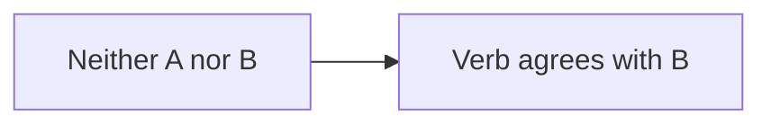
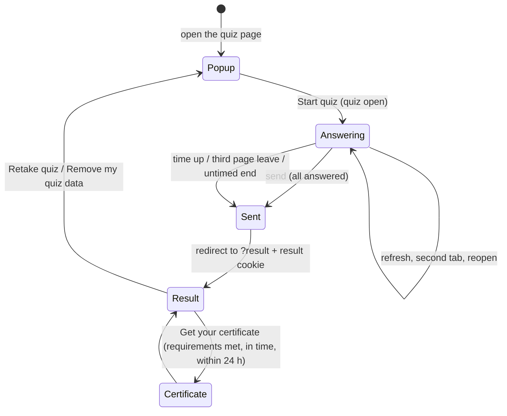

# Quiz extension for Datenstrom Yellow

Version **0.9.1-custom.14**

Multiple-choice and true/false quizzes for [Datenstrom Yellow](https://datenstrom.se/yellow/). A quiz is a plain text file; one shortcut puts it on a page. Students who reach the requirements set for the quiz's categories can create a PDF certificate, which is recorded on the server so it can be verified and reprinted.

The extension is built for **formative, process-oriented, low-stakes assessment**:

- students may retake a quiz as often as they like;
- nothing is stored on the server about students who do not create a certificate;
- there is no database, and the server writes a file only when a certificate is created;
- the interface is always in English.

---

## Contents

1. [Features](#features)
2. [Requirements](#requirements)
3. [Installation](#installation)
4. [Quick start](#quick-start)
5. [Site settings](#site-settings)
6. [Shortcuts](#shortcuts)
7. [Quiz identity](#quiz-identity)
8. [Writing a quiz file](#writing-a-quiz-file)
9. [Quiz settings](#quiz-settings)
10. [Certificate requirements per category](#certificate-requirements-per-category)
11. [Scoring](#scoring)
12. [The start popup](#the-start-popup)
13. [Taking the quiz](#taking-the-quiz)
14. [Leaving the page](#leaving-the-page)
15. [Sending the answers](#sending-the-answers)
16. [The result page](#the-result-page)
17. [Schedule](#schedule)
18. [Certificates](#certificates)
19. [Reprinting certificates](#reprinting-certificates)
20. [Certificate records](#certificate-records)
21. [Leaderboard](#leaderboard)
22. [Media, diagrams and charts](#media-diagrams-and-charts)
23. [Security](#security)
24. [Stored data and privacy](#stored-data-and-privacy)
25. [Appearance](#appearance)
26. [Texts](#texts)
27. [How it works](#how-it-works)
28. [Technical reference](#technical-reference)
29. [Limits](#limits)
30. [Troubleshooting](#troubleshooting)
31. [Credits](#credits)
32. [Appendix: all texts](#appendix-all-texts)

---

## Features

| Feature | What it does |
|---|---|
| Start popup | A quiz opens with a popup that describes it. Questions and time start only after **Start quiz** |
| Question types | Multiple choice with any number of options, and true/false |
| Categories | Questions are grouped with `@ Name`; mastery is reported per category |
| Requirements per category | `@ Name \| pass: 80` makes a category count for the certificate; categories without `pass` still count for the score |
| Score 0–100 | Always scaled to 0–100, whatever the number of questions |
| Correction for guessing | Optional: wrong answers lower the score, empty answers do not |
| Timer | A light ribbon at the top of the screen that grows warmer as time runs out |
| Required answers | Every question must be answered before sending, except for automatic sending |
| Page-leave detection | Leaving the page for 10 seconds or more counts; the third time sends the answers |
| Protection | The answer key is never in the page; times and results are signed; copying and printing are blocked |
| Review modes | Own answers marked, with the answer key, or the result card only |
| Schedule | A quiz can open and close at given times |
| Certificates | PDF certificates; one per person per quiz, highest score kept; reprint by number |
| Records | One CSV file per quiz with certificate holders, device code and time taken |
| Leaderboard | A ranking of one quiz on any page |
| Media | Images, audio, video, YouTube, Vimeo, iframes, Mermaid diagrams, Chart.js charts |
| Wide diagrams and charts | Wider than the quiz and centred on the screen, readable on phones |
| Theme-safe | Protected against theme styles; phone layout; reduced-motion support |

---

## Requirements

| Item | Requirement |
|---|---|
| CMS | Datenstrom Yellow (tested with 1.0.3) |
| PHP | Must be able to write to `system/workers/` (tested with PHP 8.3) |
| Browser | JavaScript enabled; without JavaScript a quiz cannot be taken |

---

## Installation

1. Copy `quiz.php`, `quiz.js` and `quiz.css` to `system/workers/`.
2. Put quiz files (`.txt`) in `media/quiz/`.
3. Set the time zone of the site in `system/extensions/yellow-system.ini`, for example:

```ini
CoreTimezone: Asia/Jakarta
```

`quiz.js` and `quiz.css` are added to the head of every page. Their addresses end with `?v=0.9.1-custom.14`, so browsers load new files after an update instead of old copies from their cache.

### Files created automatically

| File or folder | Location | Content |
|---|---|---|
| `quiz-secret.php` | `system/workers/` | A random 256-bit key (64 hexadecimal characters), created once when a quiz page is first opened, unless `QuizSecret` is set |
| `quiz-data/` | `system/workers/quiz-data/` (default) | Certificate records |
| `quiz-data/.htaccess` | in the data folder | Denies web access on Apache |
| `quiz-data/index.html` | in the data folder | Empty file; also the write lock and the time marker of the automatic clean-up |
| `<quiz>-<code>.csv` | in the data folder | One record file per quiz, created with its first certificate |

**Do not change or delete `quiz-secret.php` while quizzes are in use.** A new key makes every running attempt and every result stored in browsers invalid. Recorded certificates stay valid and can still be reprinted.

### nginx

`.htaccess` works only on Apache. On nginx, block the data folder and the key in the server configuration:

```nginx
location ~ ^/system/workers/(quiz-data/|quiz-secret\.php) {
    deny all;
    return 404;
}
```

If `QuizDataDirectory` points elsewhere, block that folder too.

---

## Quick start

`media/quiz/grammar-check.txt`:

```
= time: 10
! Read each question carefully.
@ Grammar | pass: 60
1. She ______ to school every day. | goes | go | going | gone
2. They ______ finished their work yet. | haven't | hasn't | didn't | isn't
- "Information" is an uncountable noun. | 1
```

On a Yellow page:

```
[quiz grammar-check.txt]
```

The popup shows "Grammar: at least 2 of 3 right". A student who answers at least two questions correctly can create a certificate.

---

## Site settings

Written in `system/extensions/yellow-system.ini` as `Name: value`. Missing settings use their default.

| Setting | Default | Allowed values | Meaning |
|---|---|---|---|
| `QuizDirectory` | `media/quiz/` | A folder ending with `/` | Folder of the quiz files. Files outside it are always refused |
| `QuizCertificateKeepDays` | `30` | `0`, or a number of days | How long certificate records are kept. After that they are removed and cannot be reprinted. `0` keeps them forever. Fractions are rounded up (at least 1 day). Empty, negative or non-numeric values mean 30. A change applies to all records, existing ones included |
| `QuizSecret` | empty | Text of at least 16 characters | An own secret key. Empty or shorter than 16 characters: the generated `quiz-secret.php` is used. Useful when PHP cannot write to `system/workers/`, or when a site runs on several servers |
| `QuizDataDirectory` | empty (= `system/workers/quiz-data/`) | A folder | Where certificate records are stored. Created automatically; must be writable by PHP and closed to web access |
| `QuizMermaidUrl` | `https://cdn.jsdelivr.net/npm/mermaid@11/dist/mermaid.min.js` | Address of a JavaScript file | Mermaid library for diagrams. Loaded only by quizzes that contain a diagram, and only when the page does not already have Mermaid |
| `QuizChartUrl` | `https://cdn.jsdelivr.net/npm/chart.js@4/dist/chart.umd.min.js` | Address of a JavaScript file | Chart.js library for charts. Loaded only by quizzes that contain a chart, and only when the page does not already have Chart.js |

### Yellow settings used by the quiz

| Setting | Used for |
|---|---|
| `CoreTimezone` | Time zone of `open` and `close`, of the times in the closing banner, and of the date stored with each certificate. With `UTC`, "08:00" means 15:00 in Jakarta |
| `Sitename` | Printed at the top of the certificate and around its stamp; printed alone when a quiz page is printed |
| `CoreServerBase`, `CoreAssetLocation` | Where `quiz.js` and `quiz.css` are loaded from |

The page or site `Language` setting does not change the quiz: it is always in English.

### Recommended settings

```ini
CoreTimezone: Asia/Jakarta
QuizCertificateKeepDays: 180
```

Use 180 (or `0`) when certificates are collected during a semester; with 30 days, certificates from the beginning of the semester are removed before it ends.

---

## Shortcuts

### `[quiz]`: show a quiz

```
[quiz file.txt]
[quiz file.txt "Quiz title"]
[quiz folder/file.txt]
```

| Part | Required | Meaning |
|---|---|---|
| `file.txt` | yes | Quiz file inside `QuizDirectory`; subfolders allowed. Must start with a letter or digit and may contain only letters, digits, `_`, `-`, `.` and `/`. `..` is refused |
| `"Quiz title"` | no | Title in the popup and on the certificate. Without it, or with `-`, the page title is used |

| Situation | Result |
|---|---|
| File not found, name not allowed, or no valid question | The shortcut shows nothing |
| More than 300 questions | A notice asks to split the quiz |
| The secret key cannot be created | A notice says the quiz cannot be used yet |

Pages with a quiz are sent with `Cache-Control: no-store, max-age=0`, so browsers and proxies never show an old copy.

### `[quizcertificate]`: reprint page

```
[quizcertificate]
```

No arguments. Shows a form to reprint a certificate by its number. The same form is in every quiz popup (**Reprint it**), so this page is optional.

### `[quizleaderboard]`: leaderboard

```
[quizleaderboard file.txt]
[quizleaderboard file.txt 10]
```

| Part | Required | Meaning |
|---|---|---|
| `file.txt` | yes | The quiz file, written as in `[quiz …]` |
| A number | no | Show only this many rows from the top |

---

## Quiz identity

A quiz is identified by **the page address + the quiz file name**.

| Situation | Result |
|---|---|
| The same file on two pages | Two separate quizzes: separate attempts, results and record files. The leaderboard combines them |
| The page is moved or renamed, or the file is renamed | It becomes a new quiz: running attempts and stored results no longer open; new certificates go to a new record file. Existing certificates stay reprintable |

---

## Writing a quiz file

A quiz file is a UTF-8 text file in `QuizDirectory`.

### Example

```
= time: 20, penalty: 0, shuffle: 1, review: 0, open: 2026-10-01 00:00, close: 2027-06-30 23:59
! This quiz checks subject–verb agreement.
! You must answer every question before you can submit.
# Concord

@ Tricky Subjects | pass: 70
Some subjects look plural but take a singular verb.
1. The number of applicants ___ increased this year. | has | have | are | were
2. A number of students ___ complained. | have | has | is | was
- "Mathematics" takes a plural verb. | 0

@ Practice Corner
3. Here ___ the documents you asked for. | are | is | was | has been
```

Here "Tricky Subjects" decides the certificate (at least 70%), while "Practice Corner" only counts for the score.

### Line types

The first character of a line decides its type.

| Line starts with | Type | Meaning |
|---|---|---|
| `=` | Settings | Quiz settings (see [Quiz settings](#quiz-settings)). Several `=` lines are combined; a later value replaces an earlier one |
| `!` | Popup instruction | One instruction line in the start popup. Text formatting works. A line starting with `). A `@` line without a name is ignored |
| `1.`, `2.`, … | Question | Numbers need not be in order; questions are numbered again on screen |
| `-`, `+`, `*` and a space | Question | A question without a number |
| `#` to `######` | Heading | A heading in the quiz (six levels) |
| ` ``` ` | Block | Mermaid diagram, Chart.js chart or code block |
| `<iframe`, `<audio`, `<video` | Embed | Pasted embed code |
| Anything else | Text | A paragraph |
| Empty | — | Ignored |

A line is a question only when it starts with a question marker **and** contains `|`. A line starting with `-` without `|` is a paragraph.

### Multiple-choice questions

```
1. Question text | correct answer | distractor | distractor | distractor
```

- Parts are separated by `|`; the character `|` cannot be used inside a question or an option.
- **The first option after the question is always the correct answer.**
- Options are **always shuffled** on screen for every attempt, so the position of the correct answer cannot be predicted.
- Any number of options (at least two). Letters A, B, C… are added automatically.

### True/false questions

```
- A true statement. | 1
- A false statement. | 0
```

| Value | Meaning | Correct answer |
|---|---|---|
| `1` | The statement is true | True |
| `0` | The statement is false | False |

True is always shown first and False second.

### Text formatting

| Write | Result |
|---|---|
| `**bold**` | **bold** |
| `*italic*` | *italic* |
| `[text](https://example.com)` | A link |
| `https://example.com` | An automatic link |
| `` | An image, audio, video, YouTube or Vimeo (see [Media](#media-diagrams-and-charts)) |
| `\n` | A line break |
| `\\` | A backslash |

Other HTML is shown as text and never executed.

### Where text and media appear

| Position in the file | Position on screen |
|---|---|
| Before the first question and before the first `@` | Opening section, above all categories |
| Right after `@ Name`, before its first question | Introduction of the category, under its heading. **Use this place for a reading text** that belongs to all questions of the category: it always stays on top, also when the questions are shuffled |
| Between two questions | **Travels with the next question**, also when questions are shuffled |
| After the last question of a category | End of that category |

Every category is one block: its heading, text, media, diagrams and charts always stay inside it. The same text and media also appear in the answer review.

### Categories

- `@ Name` starts a category; all questions below belong to it until the next `@` line.
- Categories keep the file order; questions are numbered continuously.
- A category without questions is not shown.
- Without any `@` line, all questions form one unnamed group; the result shows one mastery figure and the quiz has **no certificate**.
- Questions before the first `@` in a file that also has named categories form a category called **General**. General has no `@` line, so it can never have a `pass`: it counts for the score but never for the certificate.

---

## Quiz settings

One or more `=` lines with `name: value` pairs separated by commas, in any order:

```
= time: 90, penalty: 0, shuffle: 1, review: 0, open: 2026-10-10 08:00, close: 2026-10-10 10:00
```

Names are not case-sensitive. Missing settings use their default. **Invalid values are ignored without a message** and the default is used. Unknown names are ignored.

| Setting | Default | Values |
|---|---|---|
| `time` | number of questions (1 minute each) | `0`, or whole minutes up to `10080` |
| `penalty` | `0` | `0`, `1` |
| `shuffle` | `1` | `0`, `1` |
| `review` | `0` | `0`, `1`, `card` |
| `open` | none | date and time |
| `close` | none | date and time |

### `time`

| Value | Meaning |
|---|---|
| not set | 1 minute per question |
| `0` | No time limit; no timer ribbon |
| `1`–`10080` | Time limit in minutes (10080 = 7 days) |
| above 10080 (up to 5 digits) | Treated as 10080 |
| anything else | Ignored: 1 minute per question |

- Time starts when **Start quiz** is pressed and is measured by the server; the device clock does not matter.
- When time is up, the answers are sent automatically; unanswered questions score 0.
- Answers arriving more than **60 seconds** after the limit are **late**: the score is shown, but there is no certificate.
- An attempt stays usable for the time limit + 15 minutes; after that, the popup is shown again.

### `penalty`

| Value | Meaning |
|---|---|
| `0` | Wrong and empty answers both score 0 |
| `1` | Correction for guessing: a wrong answer scores −1 ÷ (number of options − 1); an empty answer scores 0 |

Because every question must be answered before sending, students cannot leave uncertain questions empty (except when the answers are sent automatically). With `penalty: 1`, explain this in a `!` line.

### `shuffle`

| Value | Meaning |
|---|---|
| `1` | Questions are shuffled for every attempt **inside their category**; categories keep the file order |
| `0` | Questions keep the file order |

Options are always shuffled (true/false always shows True first). The order of an attempt stays the same after a refresh.

### `review`

| Value | Shown after sending |
|---|---|
| `0` | The result card and every question with the student's answer marked: right in green and bold, wrong in red and struck through. **The correct answer of a wrong or empty question is not shown** |
| `1` | As `0`, plus the correct answer of every wrong or empty question in bold |
| `card` | **Only the result card**: score, mastery per category, certificate button and messages |

`card` is not case-sensitive. Only `0`, `1` and `card` are accepted.

### `open` and `close`

| Format | Example |
|---|---|
| Date and time | `2026-10-10 08:00` |
| With seconds | `2026-10-10 08:00:30` |
| Date only (00:00) | `2026-10-10` |

| Written | Meaning |
|---|---|
| Neither | Always open |
| Only `open` | Opens at that time, never closes |
| Only `close` | Open from the start, closed from that time until `close` is changed |
| Both | Open between the two times |

24-hour time in the site time zone (`CoreTimezone`). Impossible dates (`2026-13-45`) are ignored. To reopen a closed quiz, change or remove `close`. See [Schedule](#schedule).

---

## Certificate requirements per category

A category becomes a certificate requirement by writing `pass` after its name:

```
@ Structure — Level 1 | pass: 70
```

### How to write it

| Written | Meaning |
|---|---|
| `@ Name` | The category counts for the score, **not** for the certificate |
| `@ Name \| pass: 80` | The category must reach at least 80% mastery |
| `@ Name \| pass: 0` | The category is a requirement that everybody meets (written on purpose) |
| `@ Name \| Pass : 75.25` | Accepted: names are not case-sensitive, spaces are allowed, decimals are rounded to one decimal (75.3) |
| `@ Name \| pass: 120`, `pass: abc`, `passing: 80` | Not valid: the category has no requirement |

The category name is the text before `|`.

### When is there a certificate?

| Quiz | Certificate |
|---|---|
| No `@` line at all | **No certificate** |
| `@` categories, but none with `pass` | **No certificate** |
| At least one category with `pass` | A certificate when **every** category with `pass` reaches its pass mark |
| All categories with `pass: 0` | A certificate for every attempt sent in time |

Categories without `pass` (and the General category) still count fully for the score and are shown on the result card and the certificate.

### Example

| Category | Questions | `pass` | Requirement |
|---|---|---|---|
| Category 1 | 10 | 80 | at least 8 of 10 right |
| Category 2 | 12 | 60 | at least 8 of 12 right (7 of 12 is only 58.3%) |
| Category 3 | 3 | — | not required |

| | Category 1 | Category 2 | Category 3 | Score | Certificate |
|---|---|---|---|---|---|
| Student A | 9/10 ✓ | 8/12 ✓ | 0/3 | 68 | yes |
| Student B | 10/10 ✓ | 7/12 ✕ | 3/3 | 80 | no |

Student B has the higher score but no certificate, because Category 2 is required. The score answers "how much of the quiz was mastered"; the certificate answers "was every required category mastered". The result card shows exactly what is missing (see [The result page](#the-result-page)).

### Advice for quiz authors

- Give `pass` only to categories that represent something a certificate should guarantee.
- A category with `pass` should have **at least 5 questions**. With 2 or 3 questions, one answer decides: 70% of 3 questions means all 3.
- Small categories (or a short practice part) can be left without `pass`; they still count for the score.

---

## Scoring

### Points per question

| Answer | `penalty: 0` | `penalty: 1` |
|---|---|---|
| Right | 1 | 1 |
| Wrong | 0 | −1 ÷ (options − 1) |
| Empty | 0 | 0 |

| Options | Penalty for one wrong answer |
|---|---|
| 2 (true/false) | −1 |
| 3 | −0.5 |
| 4 | −0.333… |
| 5 | −0.25 |

### Score and mastery

**Score = points ÷ number of questions × 100**, kept between 0 and 100, rounded to one decimal.

**Mastery of a category = points of its questions ÷ number of its questions × 100**, with the same rules.

A category reaches its pass mark when **mastery ≥ pass**, comparing the rounded mastery (79.96 is shown as 80 and passes `pass: 80`).

Example (20 questions, 4 options, `penalty: 1`): 15 right, 4 wrong, 1 empty → 15 − 4/3 = 13.667 → **68.3**; the result card states a penalty of −6.7 points for 4 wrong answers.

### Right answers needed

Without penalty, the requirement is shown as a number of right answers: the smallest number whose mastery reaches the pass mark. With 12 questions and `pass: 60`, 7 right gives 58.3%, so **8** are needed.

With penalty, wrong answers also lower the mastery, so the requirement is shown as a percentage; the result card then counts the fewest extra right answers needed, starting with the answers that gain the most (a wrong answer made right gains more than an empty one).

### Verification

Score, mastery, the certificate decision and every line of the hint were compared with an independently written reference calculation on 2,000 random answer sets: all results were identical.

---

## The start popup

Opening a quiz page shows only the popup: the questions are not in the page yet, and the time has not started. The page behind it cannot be scrolled.

| Row | Content |
|---|---|
| Title | The quiz title |
| Questions | Number of questions |
| Time | "20 minutes", "1 minute" or "No time limit" |
| Opens / Closes | Shown only with `open` / `close`, e.g. "1 October 2026, 00:00" |
| Penalty | "None", or "Wrong answers lower the score (correction for guessing)" |
| Parts | Names of the categories (only with named categories) |
| Certificate | One line per category (see below), or "No certificate for this quiz" |
| Instructions | The `!` lines |
| Rule | "Leaving this page for 10 seconds or more is counted. The third time, your answers are submitted automatically." |
| Last score | "Your last score on this quiz: 85 (4 October 2026)" — if this browser took the quiz in the last 30 days — followed by **View last result** while the full result is stored (24 hours) |
| Buttons | **Start quiz** and **Not now** |
| Bottom | "Need an earlier certificate again? **Reprint it**", and **Remove my quiz data from this browser** when this browser holds data of the quiz |

### The Certificate row

| Category | Line |
|---|---|
| With `pass` (no penalty) | "Structure — Level 1: at least 7 of 10 right" |
| With `pass` (penalty on) | "Grammar: at least 80%" |
| With `pass: 0` | "Grammar: no minimum" |
| Without `pass` | "Practice: not required" |
| Quiz without requirements | "No certificate for this quiz" |

### Buttons

| Control | Action |
|---|---|
| **Start quiz** | Starts a new attempt and shows the questions, with a "Preparing your quiz…" layer. Pressing it twice starts one attempt; a running attempt continues |
| **Not now** | Back to the previous page if it is on the same site; otherwise the home page |
| **View last result** | Opens the stored result |
| **Reprint it** | Shows the reprint form in the popup; **← Back** returns |
| **Remove my quiz data from this browser** | See [The result page](#the-result-page) |

Before `open` the popup says "This quiz opens on …"; from `close` on it says "This quiz closed on … It can no longer be started."; neither has a Start button.

If JavaScript does not run, "Please enable JavaScript to take this quiz." appears after 1.5 seconds (at once with "reduce motion"); questions and timer stay hidden.

---

## Taking the quiz

- Each question is a card with its number, text and options (A, B, C…), arranged in category blocks with their headings and texts.
- Every answer is saved in the browser at once. A refresh, closing and reopening the tab, or a second tab continues the **same attempt** with the same order, answers and remaining time.
- With the browser's Back button, a page restored from the cache is reloaded to show the correct state.
- The send button says "Correction and score".

### Timer (quizzes with a time limit)

| Part | Description |
|---|---|
| Position | Fixed at the top centre of the screen (layer 999); stays while scrolling |
| Content | Clock icon, "Time left", remaining `minutes:seconds`, and "12/20 answered" |
| Line | A thin line at the bottom shrinks with the time |
| Colours | Neutral above half the time; below half it warms up gradually to amber and then soft red, with a growing glow; no blinking |
| Phones | The words "Time left" are hidden |

Without a time limit there is no timer and no answered counter. When time is up, "Time is up. Your answers are being submitted…" appears and the answers are sent; opening the quiz after its time ran out sends them at once.

### Unanswered questions

- Sending with questions not answered shows a box: "Not all questions are answered", the count, and the numbers of those questions (up to 10, then "and N more").
- Tapping a number goes to that question; **Back to the questions**, a click outside or **Escape** goes to the first one.
- Each unanswered question shows "Not answered yet" until it is answered.
- There is **no "send anyway"**.

---

## Leaving the page

| Event | Result |
|---|---|
| Away less than 10 seconds | Not counted |
| Away 10 seconds or more | Counted; on return a 7-second message: "You left the quiz page for 14 seconds (1 of 3). After the third time, your answers are submitted automatically." |
| Third count | The answers are sent automatically |

| Situation | Counted? |
|---|---|
| Other tab or app, minimised browser, locked phone, phone Home button | Yes |
| Closing the tab and opening the quiz again | Yes, measured from the last moment the page was visible |
| The browser freezing the page silently | Yes (a check runs every second) |
| Clicking or playing media inside a quiz iframe | **No** |
| Leaving from inside such an iframe to another window | Yes |
| Third count reached but sending failed | The answers are sent when the quiz is opened again |

The number of page leaves is shown on the result card.

---

## Sending the answers

1. All questions answered → the button is pressed.
2. The button is disabled and "Checking your answers…" appears.
3. The browser opens the result page at `…/page/?result`.

Answers are sent automatically, **even incomplete**, when time is up, on the third page leave, or 30 minutes after closing for untimed quizzes (see [Schedule](#schedule)). Unanswered questions score 0, without penalty.

Answers with a changed, foreign or expired attempt are not graded: "This attempt is not valid or has expired. Please retake the quiz."

---

## The result page

### Result card

| Element | Example | When |
|---|---|---|
| Score box | **85** / 100 | Always |
| Right answers | Right answers: 17 out of 20 | Always |
| Score line | Score: 85 out of 100 | Always |
| Mastery per category | Grammar **90%** ✓, Practice **50%** | With named categories |
| ✓ / ✕ | ✓ at or above the category's pass mark, ✕ below it | Only for categories with `pass` |
| Category note | "Mastery per part is the percentage of questions answered correctly in that part." + "✓ and ✕ mark the parts that count for the certificate." | With categories (second sentence only with requirements) |
| Mastery sentence | "Mastery: **85%**. This percentage shows how much of the material you have mastered." | Without categories |
| Penalty note | "Penalty for wrong answers is on: -6.7 points for 4 wrong answers." | With `penalty: 1` |
| Page leaves | "You left the quiz page 2 times for 10 seconds or more." / automatic-sending notice | When applicable |
| Certificate button | see below | |
| **Retake quiz** | Opens the start popup | Always |
| What is missing | see below | When a required category is below its pass mark |

The maximum (100) appears on the web page only; the certificate shows the score without a maximum.

### What the certificate still needs

When a required category has not reached its pass mark, the card shows one line per such category:

```
Your certificate still needs:
Structure — Level 1: 6 of 10 right — at least 7 needed
```

With `penalty: 1`:

```
Your certificate still needs:
Grammar: 55.6% — at least 60% needed (1 more right answer)
```

### Certificate button

| State | Shown |
|---|---|
| Available | **Get your certificate**; the certificate box opens by itself after a moment |
| Already created for this attempt | A disabled button: "Certificate issued to Rina Wulandari" |
| More than 24 hours after sending | "The time to create a certificate for this attempt has passed." |
| Not reached, late, or no requirements | No button |

Late answers show: "The time limit had already passed when the answers were submitted. No certificate is available for this attempt."

### Answer review

Follows `review` (see [Quiz settings](#quiz-settings)), with the opening section, category texts and media in the order of the attempt. An empty question shows "Not answered".

### Where the result is kept

The result is kept **only in the student's browser**, signed by the server; not on the server and not in the address.

| Event | Result |
|---|---|
| Refresh | The same result |
| **View last result** | The full result, while stored |
| `…/page/?result` in another browser or device, or a shared link | **Only the start popup**; no questions, answers or key |
| After 24 hours | The full result is removed |
| After 30 days | The last score in the popup is removed |
| Browser data cleared | The result is gone; a certificate already created stays on the server |

### Remove my quiz data from this browser

On the result page and in the popup (not on the question page). After a confirmation in the quiz's own box ("Remove your results for this quiz from this browser? If you have not created your certificate yet, you can no longer create it from this attempt.", buttons **Remove** and **Cancel**; Cancel has the focus; Escape or a click outside cancel), it removes the result, the last score and the remembered name. It keeps the device stamp and every certificate.

**Retake quiz** opens the popup; there is no limit on retakes.

---

## Schedule

| State | Students see |
|---|---|
| Before `open` | "This quiz opens on 10 October 2026, 08:00.", no Start button |
| Open | Normal |
| From `close` on | "This quiz closed on 13 October 2026, 08:00. It can no longer be started.", no Start button |

The schedule is checked by the server.

**Attempts started before closing may be finished** until the student sends them, their own time runs out, or the third page leave. An attempt of a quiz **without a time limit** that started before closing ends **30 minutes after closing**; the answers are then sent automatically.

A calm banner under the timer (or at the top without a timer) never blinks and never asks students to send:

| When | Text |
|---|---|
| From 10 minutes before closing | "This quiz closes to new attempts at 08:00. You can continue this attempt until your own time runs out." |
| After closing | "This quiz is now closed to new attempts. You can continue this attempt until your own time runs out." |
| Untimed quiz | "…You can continue this attempt until 08:30. At that time, your answers are sent automatically." |

---

## Certificates

### Requirements

The quiz has at least one category with `pass`; every such category reached its pass mark; the answers arrived in time; the certificate is created **within 24 hours** after sending.

### The certificate box

| Step | Content |
|---|---|
| 1. Name | "Type your full name (not a nickname or initials) exactly as it should appear on the certificate.", a field (at most 60 characters), the warning that the certificate can be created only once for this attempt, **Close** and **Continue** |
| 2. Confirm | The name in large letters, **Change name** and **Yes, create certificate** |
| 3. Done | The message; the PDF downloads |

| Server answer | Message |
|---|---|
| Created | "Certificate issued to …" |
| Same person, equal or higher score already | "You already have a certificate for this quiz with a higher or equal score (92). That certificate has been downloaded." |
| This attempt already has a certificate for another name | "The certificate for this attempt has already been issued to … Retake the quiz to get a new one." |
| After 24 hours | "The time to create a certificate for this attempt has passed." |
| Data cannot be stored | "The certificate cannot be saved because the server cannot write data…" |
| Other problem | "The certificate could not be created. Check your connection and try again." |

### Name rules

1–60 characters, any letters; repeated spaces become one; control and invisible characters are removed. The name is remembered by the browser after **Yes, create certificate**.

### One attempt, one certificate; one person, the highest score

| Situation | Result |
|---|---|
| Same attempt, same name | The same certificate again |
| Same attempt, another name | Refused |
| Same person, same quiz, lower or equal score | The better certificate is kept and downloaded |
| Same person, same quiz, higher score | The old record is replaced; **the old number is no longer valid** |

"Same person" means the same full name (case and extra spaces ignored) and the same **device stamp**: 24 random characters the browser creates for the first certificate request and keeps. Another device counts as another person (a separate record). Simultaneous requests for one attempt are processed one by one.

### The PDF

A4 landscape, drawn by the browser, file `certificate-<name>.pdf` (accents removed, other characters `-`, lower case):

| Part | Content |
|---|---|
| Frame | Double teal–violet frame |
| Site name | `Sitename` in capitals |
| Heading | "Certificate of Completion" |
| Body | "This is to certify that", the name, "has successfully completed", the quiz title (up to two lines), "demonstrating 85% mastery of the material", mastery per category (up to three lines, with categories) |
| Footer | Date in English ("4 October 2026"), the score in a medallion (no maximum), the certificate number with a round stamp (site name around the edge, or CERTIFIED, a star and the year) |

### Certificate number

10 characters, 0–9 and A–F (e.g. `7FE2CB6E32`), unique, over a trillion possible values.

---

## Reprinting certificates

In every quiz popup (**Reprint it**) and on a `[quizcertificate]` page:

- type the number (spaces, dashes and lower case accepted) and press **Reprint PDF**;
- a wrong format is refused before sending: "A certificate number has 10 characters (letters A–F and digits).";
- found: the PDF downloads and "The certificate for … has been downloaded." appears;
- not found (wrong, expired or replaced): "No certificate with this number was found. It may have been deleted because its storage period has ended."

Reprinting works from any device while the record is kept. To check a certificate, compare its number with the records.

---

## Certificate records

One CSV file per quiz in the data folder: `<quiz file name>-<6-character code>.csv`. Only students who create a certificate are recorded. The first line holds the column names.

| Column | Content | Example |
|---|---|---|
| `issued` | Date and time (site time zone) | `2026-10-04 13:47:02` |
| `certificate_no` | Number | `7FE2CB6E32` |
| `name` | Full name | `Rina Wulandari` |
| `device` | 6-character code derived from the device stamp; empty without a stamp | `a91f3c` |
| `minutes` | Time from Start to sending (server) | `18.5` |
| `score` | Score | `85` |
| `percent` | Overall mastery (equal to the score) | `85` |
| `quiz_title` | Title | `TEP Practice Test` |
| `attempt` | Attempt code | 20 characters |
| `parts` | Mastery per category, `Name=value;Name=value` | `Grammar=90;Reading=80` |
| `identity` | Person code (name + device) | 16 characters |

- Values starting with `=`, `+`, `-`, `@`, a tab or a line break are stored with a leading `'`, so spreadsheets do not run them as formulas; the `'` is removed on reprint.
- Writes are made one at a time (lock); appends are cut back if writing fails; replacements go through a temporary file.
- **The quiz writes only to record files whose first line is exactly the current column list.** A file with other columns (for example saved again from a spreadsheet) is never written to: a new certificate for that quiz returns "the server cannot write data", and the automatic clean-up leaves the file untouched.
- A file may grow to 5 MB.
- Records older than `QuizCertificateKeepDays` are no longer found at once, and are removed during a clean-up that runs at most once per hour when a quiz or reprint page is opened. No cron job is needed.

### Spotting one device used for many names

Open a **copy** of the file in a spreadsheet, sort by `device`, highlight duplicate values, and look at `minutes`. Several names on one device are a hint (lab computers and borrowed phones are common), not proof. Never save an edited spreadsheet back into the data folder.

---

## Leaderboard

`[quizleaderboard file.txt]` shows **No., Name, Score, Date** for one quiz file:

- each full name once with its best score (case and extra spaces ignored);
- highest score first; equal scores by the earlier certificate;
- all pages using that file combined; expired records not shown;
- **never shown:** certificate numbers, device codes, attempt codes, person codes, time taken;
- without certificates: "No certificates yet."

Names are visible to everyone who can open the page.

---

## Media, diagrams and charts

Only addresses starting with `https://`, `http://` or a single `/` are used; anything else is dropped.

### Short form ``

| Address | Result |
|---|---|
| YouTube (`watch?v=`, `youtu.be/`, `embed/`, `shorts/`, `live/`) | Privacy-enhanced YouTube player (`youtube-nocookie.com`), plays inside the page, no full-screen button, no related videos from other channels |
| Vimeo (`vimeo.com/123`, `player.vimeo.com/video/123`) | Vimeo player |
| `.mp3 .m4a .aac .ogg .oga .opus .wav .flac` | Audio player |
| `.mp4 .m4v .webm .ogv .mov` | Video player |
| Anything else | Image (the text becomes its description; loaded when near the screen) |

### Embed code

Lines starting with `<iframe`, `<audio` or `<video` (up to 40 more lines until the closing tag). The code is **rebuilt**:

| Tag | Kept |
|---|---|
| `<iframe>` | `src`, `width`, `height`, `title` |
| `<audio>` | `src`, `<source src type>` |
| `<video>` | `src`, `width`, `height`, `poster`, `<source src type>` |

### Media behaviour

iframes load lazily in a sandbox (scripts, own site and forms allowed; no pop-ups, new tabs or page navigation; no full screen). Audio and video have controls, load only when played, and have no download, full screen, remote playback or picture-in-picture (closed at once if a phone enters them). Page full screen is closed at once so the timer stays visible. Using media inside a quiz iframe is not counted as leaving the page.

### Mermaid and Chart.js

````

````

````
```chartjs
{ "type": "bar", "data": { "labels": ["Part 1", "Part 2"], "datasets": [{ "label": "Questions", "data": [10, 10] }] } }
```
````

` ```chart ` also works; the content is JSON or a JavaScript object and runs as JavaScript (only trusted people should edit quiz files). A quiz's own copy of Mermaid uses `securityLevel: "strict"`. Other ```` ``` ```` blocks are shown as code.

### Width of diagrams and charts

| Screen | Width |
|---|---|
| Up to 600 px | 97.5% of the screen |
| Wider | 90% of the screen, at most 1400 px |

The area is centred on the screen and is never narrower than the quiz. It is widened only when the theme's content column is centred (within 5% of its width, at least 24 px), so a sidebar is never covered, and it keeps the quiz width if a theme wrapper would cut it off. Diagrams keep their own size and are never drawn smaller than 60% of it (a long diagram then scrolls inside its block on a phone). Charts are 2:1 (3:2 on phones) and never taller than 75% of the screen (`maintainAspectRatio` is set to `false` unless the chart sets it). The layout is recomputed on resize, rotation and after drawing; before that, and without JavaScript, blocks keep the quiz width.

---

## Security

| Threat | Protection |
|---|---|
| Reading the answer key | Never sent; every option carries a 16-character code signed with the quiz, attempt, question and option; only the server knows which is right |
| Reading questions before starting | Questions are rendered only after Start |
| Extending the time | Signed start time; time measured by the server |
| Changing answers or score for a certificate | Signed result and certificate data; scores recomputed on the server |
| Using another quiz's result | The quiz is part of every signature |
| Sharing the result link | The result exists only in the taker's browser |
| Certificates for several people from one attempt | One attempt, one certificate, one name |
| Guessing certificate numbers | Over a trillion possible values |
| Opening outside the schedule | Checked by the server |
| Copying | Right click, selection, copy, cut, drag, and Ctrl/Cmd + C, X, A, P, S, U blocked in the popup, question page and result page; text fields still work |
| Printing | Ctrl/Cmd + P blocked; printing from the menu gives a white page with the site name |
| Other tabs | Page-leave detection |
| Sending empty answers to see the key | Every question must be answered |
| Opening the data folder | `.htaccess` / nginx rule |
| Formulas in records | Leading `'` |
| Harmful code in quiz files | Text escaped, embeds rebuilt, only web addresses, strict Mermaid |
| Old copies of pages | `Cache-Control: no-store` |

Stamps are HMAC-SHA256 values made with the secret key and compared in constant time (`hash_equals`).

Not preventable in a browser and accepted for a formative quiz: photos with another device, working together, guessing, finding the key over many retakes (slower with `review: card`), developer tools, and certificates created for friends (visible through `device` and `minutes`).

---

## Stored data and privacy

### Server

| Data | When | Kept |
|---|---|---|
| `quiz-secret.php` | First use | Until removed |
| Certificate records | When a certificate is created | `QuizCertificateKeepDays` |

Answers, scores and attempts are **not** stored on the server.

### Student's browser

| Name | Type | Content | Kept |
|---|---|---|---|
| `yquiz_<quiz>` | Cookie (site) | Running attempt (random code and start time, signed) | Time limit + 15 minutes, or 24 hours without a limit (at most 7 days); removed on sending |
| `yquizr_<quiz>` | Cookie (quiz page only) | Result (times, answers, page leaves, signed) | 24 hours |
| `yquiz:<quiz>` | Local storage | Answers in progress, page-leave count | Until sending |
| `yquiz:seen:<quiz>` | Local storage | Last moment the page was seen | Until sending |
| `yquiz:last:<quiz>` | Local storage | Last score and local date | 30 days |
| `yquiz:name` | Local storage | Name for the next certificate | Until removed |
| `yquiz:device` | Local storage | Device stamp (24 characters) | Until browser data is cleared |

Cookies use `SameSite=Lax`, and `Secure` on HTTPS. `<quiz>` is the 12-character quiz code.

---

## Appearance

| Element | Appearance |
|---|---|
| Start popup | White card over a dimmed, slightly blurred page; two-column facts list; dark Start button, outlined Not now; a bottom sheet on phones |
| Question cards | Rounded cards with a light teal–violet tint |
| Category headings | The quiz's own H2 style |
| Timer | Light ribbon at the top (layer 999) |
| Closing banner | Calm amber notice under the timer |
| Dialogs | Centred cards (layer 1000); confirmation box above the popup (layer 9500) |
| Messages | Near the top, below the timer, for 7 seconds (layer 1001) |
| Loading layer | "Preparing your quiz…" / "Checking your answers…" (layer 10000) |
| Result card | Dark teal–indigo–violet card with the score box |
| Leaderboard | Plain list with a light header row |

The quiz is at most **46rem** wide. Its interface uses only `div`, `span`, `p`, `button`, `a`, `input` and `label` with quiz classes (no `dl`/`dt`/`dd`, `ul`/`li`, `h3`, `details`/`summary`) and has protective base styles, so theme styles do not reach it; the site font is kept. Screens of 600 px or less get a compact layout; "reduce motion" turns off blur and animations; printing gives a white page with the site name.

### CSS variables

Change them in the theme's CSS (not in `quiz.css`, which is replaced on updates):

```css
.quiz-container, .quiz-modal { --quiz-blue: #0f5e59; --quiz-radius: 10px; }
```

| Variable | Default | Used for |
|---|---|---|
| `--quiz-ink` | `#172033` | Main text |
| `--quiz-blue` | `#3654d6` | Chosen option, buttons |
| `--quiz-blue-dark` | `#2a44b8` | Button hover |
| `--quiz-blue-tint` | `#eef1fd` | Chosen option background, notes |
| `--quiz-accent` | `#ff8a3d` | Keyboard focus outline |
| `--quiz-red` | `#d33a2c` | Wrong answers, errors |
| `--quiz-red-tint` | `#fdf0ee` | Wrong answer background |
| `--quiz-green` | `#15895a` | Right answers |
| `--quiz-green-tint` | `#e9f7f0` | Right answer background |
| `--quiz-rule` | `#e3e7f0` | Borders of options and fields |
| `--quiz-muted` | `#61697b` | Secondary text |
| `--quiz-paper` | `#ffffff` | Options and dialogs background |
| `--quiz-bg` | `#f3f5fa` | Option letters background |
| `--quiz-teal` | `#0f9d94` | Accent colour |
| `--quiz-purple` | `#7b4bd6` | Accent colour |
| `--quiz-card-bg` | light teal–violet gradient | Question cards, reprint card |
| `--quiz-card-border` | `rgba(91, 108, 190, .2)` | Question card border |
| `--quiz-summary-bg` | dark teal–indigo–violet gradient | Result card |
| `--quiz-radius` | `14px` | Card corners |
| `--quiz-gap` | `1.75rem` (`1.35rem` on phones) | Space between cards |
| `--quiz-shadow` | soft double shadow | Card shadow (`none` for flat cards) |

---

## Texts

Every text is English, whatever the language of the site or page; every part of the quiz and everything quiz.js adds is marked `lang="en"`; dates are English ("4 October 2026"); the confirmation box is the quiz's own. The controls of the browser's built-in audio and video players follow the browser language.

Texts can be changed in `system/extensions/yellow-language.ini` **under `Language: en`** (texts under other languages are ignored):

```ini
Language: en
QuizRetake: Try again
QuizIntroPartFree: @name: practice only
```

Words starting with `@` are replaced by the quiz:

| Placeholder | Replaced by |
|---|---|
| `@score` | Score |
| `@max_score` | 100 |
| `@right_answers`, `@curr_question` | Right answers, number of questions |
| `@percent` | Mastery |
| `@count` | A count (wrong answers, page leaves, questions, extra right answers) |
| `@name` | A category name, or the name on a certificate |
| `@right`, `@total`, `@needed` | Right answers in a category, its questions, right answers needed |
| `@pass` | Pass mark of a category |
| `@list` | Mastery of every category on the certificate ("Grammar 90%, Reading 80%") |
| `@points` | Penalty points |
| `@seconds` | Seconds away |
| `@days` | Keep days |
| `@minutes` | Time limit |
| `@date` | A date |
| `@time`, `@end` | Closing time, end time |
| `@max` | Question limit |

All 111 texts are listed in the [appendix](#appendix-all-texts).

---

## How it works

| File | Runs on | Job |
|---|---|---|
| `quiz.php` | Server | Reads quiz files, keeps the key, measures time, grades, signs and checks stamps, decides certificates, stores and finds records |
| `quiz.js` | Browser | Popup, saving answers, page leaves, timer, banners, required answers, result storage, diagrams and charts, certificate PDF |
| `quiz.css` | Browser | Layout, theme protection, states set by quiz.js, print page |

The server decides; the browser displays. No attempt is stored on the server: the attempt and the result live in the browser, protected by signatures, and every value coming back is checked again.



| Step | quiz.php | quiz.js | quiz.css |
|---|---|---|---|
| Open | Popup without questions | Last score, buttons | Popup card, scroll lock |
| Start | Checks the schedule, creates and signs the attempt, renders questions | Restores answers, starts the timer | Cards, timer |
| Answer | — | Saves answers, counts leaves, banners | States and badges |
| Send | Checks the attempt, signs the result, sets cookies, redirects | Required answers, hidden fields | Dialog, loading layer |
| Result | Checks the result, grades, checks the requirements, signs certificate data | Last score, remove data, certificate box | Result card, review |
| Certificate | Checks the signature, 24 hours, name, records; writes the record | Requests, draws and downloads the PDF | Certificate box |

---

## Technical reference

### Requests

| Request | Method | Fields | Answer |
|---|---|---|---|
| Start | GET | `quiz_start=1` | Question page |
| Retake | GET | `quiz_retake=<quiz>` | Popup |
| Result | GET | `result` | Result page if this browser holds a valid result, otherwise the popup |
| Send answers | POST | `quiz_id`, `quiz_attempt`, `quiz_client=1`, `quiz_away`, `quiz_auto` (`time`, `away` or empty), `quest[<n>]` | `303` to `?result` with the result cookie |
| Create a certificate | POST | `quiz_cert=1`, `cert_payload`, `cert_sig`, `cert_name`, `cert_device` | JSON |
| Reprint | POST | `quiz_reprint=1`, `number` | JSON |

### JSON

```json
{"ok":true,"name":"Rina Wulandari","code":"7FE2CB6E32","date":"2026-10-04","title":"TEP Practice Test",
 "site":"Site Name","score":85,"pct":85,"parts":[["Structure — Level 1",90],["Reading — Passage 1",80]]}
```

A certificate answer may contain `"kept":true`.

| `error` | Meaning |
|---|---|
| `invalid` | Signature wrong, data incomplete, or number format wrong |
| `expired` | More than 24 hours after sending |
| `name` | Name empty or longer than 60 characters |
| `used` | The attempt already has a certificate for another name (`issuedTo`) |
| `not_found` | No certificate with this number |
| `storage` | The data folder cannot be written, the record file is full, or it has other columns |

JSON answers use `Cache-Control: no-store` and `X-Content-Type-Options: nosniff`.

### Stamps

| Stamp | Signed text | Length |
|---|---|---|
| Attempt | `attempt\|quiz\|seed\|start` | 16 |
| Option code | `answer\|quiz\|seed\|question\|option` | 16 (8 stored in the result) |
| Result | `result\|quiz\|seed.start.sent.leaves.reason.answers` | 32 |
| Certificate data | `cert\|` + JSON | 64 |
| Attempt code | `nonce\|quiz\|seed\|start` | 20 |
| Certificate number | `code\|attempt code\|name` | 10 |
| Person code | `identity\|name\|device` | 16 |
| Device code | `device\|device stamp` | 6 |

### Data attributes

| Element | Attributes |
|---|---|
| Question page | `data-quiz-id`, `data-attempt`, `data-time`, `data-remaining`, `data-lifetime`, `data-close-in`, `data-close-at`, `data-deadline-in`, `data-end-at`, `data-mermaid-url`, `data-chart-url`, `data-i18n` |
| Result page | `data-quiz-id`, `data-result`, `data-result-token` (only without onRequest), `data-mermaid-url`, `data-chart-url`, `data-i18n` |
| Popup, reprint form, leaderboard | `data-quiz-id` (popup), `data-i18n` |
| Chart | `data-config` |

### Yellow hooks

| Hook | Work |
|---|---|
| `onLoad` | Registers settings and texts |
| `onRequest` | Certificate and reprint requests (JSON); sent answers (redirect) |
| `onParseContentElement` | Renders the three shortcuts, runs the clean-up, handles requests itself when onRequest is not called |
| `onParsePageExtra` | Adds quiz.js and quiz.css to the page header |

---

## Limits

| Item | Value |
|---|---|
| Questions per quiz | 300 |
| Time limit | Up to 10,080 minutes |
| Late tolerance | 60 seconds |
| Attempt lifetime | Time limit + 15 minutes; 24 hours without a limit; at most 7 days |
| Certificate window | 24 hours after sending |
| Result in the browser | 24 hours |
| Last score in the popup | 30 days |
| Page leave counted | 10 seconds or more |
| Page leaves before sending | 3 |
| Closing banner | From 10 minutes before closing |
| Extra time after closing (untimed) | 30 minutes |
| Numbers in the unanswered box | 10, then "and N more" |
| Name | 1–60 characters |
| Certificate number | 10 characters (0–9, A–F) |
| Device stamp / device code | 24 / 6 characters |
| Record file | 5 MB |
| Clean-up | At most once per hour |
| Embed code | Up to 40 more lines |
| Quiz width | 46rem |
| Diagram and chart area | 90% of the screen (max. 1400 px); 97.5% up to 600 px |
| Chart height | At most 75% of the screen |
| Smallest diagram size | 60% of its own size |
| Category `pass` | 0–100, one decimal |

---

## Troubleshooting

| Problem | Solution |
|---|---|
| The shortcut shows nothing | Check the file name and folder; questions start with `1.`, `-`, `+` or `*` and a space and contain `\|` |
| The popup says "No certificate for this quiz" | Add `\| pass: …` to at least one `@` line |
| A category does not count for the certificate | Check the spelling: `@ Name \| pass: 80` (0–100) |
| "The secret key could not be created" | Let PHP write to `system/workers/`, or set `QuizSecret` |
| "The server cannot write data" | Make the data folder writable; check disk space, the 5 MB limit, and that the record file was not saved again from a spreadsheet (its first line must be the original column list) |
| "This quiz has more than 300 questions" | Split the quiz |
| "Please enable JavaScript" | JavaScript is off |
| "This attempt is not valid or has expired" | Retake the quiz |
| Schedule off by hours | Set `CoreTimezone` |
| Reopen a closed quiz | Change or remove `close` |
| Result missing on another device | By design; reprint certificates by number |
| "View last result" missing | Older than 24 hours, removed, or browser data cleared |
| Certificate number not found | Expired, or replaced by a higher score |
| The quiz became "new" after moving the page | See [Quiz identity](#quiz-identity) |
| A diagram or chart is missing | Block syntax, or the library address cannot be loaded |

---

## Credits

Based on the quiz extension 0.9.1 for Datenstrom Yellow. Keep the license of the original extension when publishing.

---

## Appendix: all texts

Generated from `quiz.php`. Texts marked *popup* are used in the start popup.

| Key | Default text |
|---|---|
| `QuizCorrected` | Here is the corrected quiz: right answers are highlighted in <b>bold</b>, wrong answers in <del class=\ |
| `QuizButton` | Correction and score |
| `QuizResult` | Right answers: <b>@right_answers out of @curr_question</b> |
| `QuizScore` | Score: <b>@score out of @max_score</b> |
| `QuizTrue` | True |
| `QuizFalse` | False |
| `QuizCertButton` | Get your certificate |
| `QuizModalTitle` | Quiz completed |
| `QuizNamePrompt` | Type your full name (not a nickname or initials) exactly as it should appear on the certificate. |
| `QuizNamePlaceholder` | Full name |
| `QuizClose` | Close |
| `QuizCertHeading` | Certificate of Completion |
| `QuizCertIntro` | This is to certify that |
| `QuizCertCompleted` | has successfully completed |
| `QuizCertScore` | Score |
| `QuizCertDate` | Date |
| `QuizCertNumber` | Certificate No. |
| `QuizTimeUp` | Time is up. Your answers are being submitted… |
| `QuizCertContinue` | Continue |
| `QuizCertWarning` | The certificate can be created only once for this attempt, and the name cannot be changed afterwards. |
| `QuizCertConfirm` | Create the certificate for this name? |
| `QuizCertConfirmYes` | Yes, create certificate |
| `QuizCertEdit` | Change name |
| `QuizCertIssued` | Certificate issued to @name |
| `QuizCertUsed` | The certificate for this attempt has already been issued to @name. Retake the quiz to get a new one. |
| `QuizCertError` | The certificate could not be created. Check your connection and try again. |
| `QuizRetake` | Retake quiz |
| `QuizNotAnswered` | Not answered |
| `QuizCorrectedMarks` | Here are your answers: correct ones are marked in green and wrong ones in red. The correct options are not shown. |
| `QuizStorageError` | The certificate cannot be saved because the server cannot write data. Please contact the site administrator. |
| `QuizMastery` | Mastery: <b>@percent%</b>. This percentage shows how much of the material you have mastered. |
| `QuizCertMastery` | demonstrating @percent% mastery of the material |
| `QuizTooLong` | This quiz has more than @max questions. Please split it into smaller quizzes. |
| `QuizCertParts` | Mastery by part: @list. |
| `QuizCategoryNote` | Mastery per part is the percentage of questions answered correctly in that part. |
| `QuizCategoryRequired` | ✓ and ✕ mark the parts that count for the certificate. |
| `QuizCertNeedHead` | Your certificate still needs: |
| `QuizCertNeedRight` | @name: @right of @total right — at least @needed needed |
| `QuizCertNeedPercent` | @name: @percent% — at least @pass% needed (@count more right answers) |
| `QuizCertNeedPercentOne` | @name: @percent% — at least @pass% needed (1 more right answer) |
| `QuizPenaltyInfo` | Penalty for wrong answers is on: -@points points for @count wrong answers. |
| `QuizAwayWarning` | You left the quiz page for @seconds seconds (@count of 3). After the third time, your answers are submitted automatically. |
| `QuizAwaySubmitted` | Your answers were submitted automatically because you left the quiz page 3 times. |
| `QuizAwayCount` | You left the quiz page @count times for 10 seconds or more. |
| `QuizJsRequired` | Please enable JavaScript to take this quiz. |
| `QuizUnansweredTitle` | Not all questions are answered |
| `QuizUnansweredOne` | 1 question is not answered yet: |
| `QuizUnansweredMany` | @count questions are not answered yet: |
| `QuizUnansweredMore` | and @count more |
| `QuizUnansweredHint` | Answer every question before you submit. Tap a number to go to that question. |
| `QuizUnansweredBack` | Back to the questions |
| `QuizUnansweredBadge` | Not answered yet |
| `QuizSubmitting` | Checking your answers… |
| `QuizIntroQuestionsLabel` *(popup)* | Questions |
| `QuizIntroTimeLabel` *(popup)* | Time |
| `QuizIntroPenaltyLabel` *(popup)* | Penalty |
| `QuizIntroPartsLabel` *(popup)* | Parts |
| `QuizIntroCertificateLabel` *(popup)* | Certificate |
| `QuizIntroPenaltyOff` *(popup)* | None |
| `QuizIntroPenaltyOn` *(popup)* | Wrong answers lower the score (correction for guessing) |
| `QuizIntroNoCertificate` *(popup)* | No certificate for this quiz |
| `QuizIntroPartRight` *(popup)* | @name: at least @needed of @total right |
| `QuizIntroPartPercent` *(popup)* | @name: at least @pass% |
| `QuizIntroPartOpen` *(popup)* | @name: no minimum |
| `QuizIntroPartFree` *(popup)* | @name: not required |
| `QuizIntroReprintAsk` *(popup)* | Need an earlier certificate again? |
| `QuizIntroReprintOpen` *(popup)* | Reprint it |
| `QuizIntroBack` *(popup)* | Back |
| `QuizIntroMinutes` *(popup)* | @minutes minutes |
| `QuizIntroOneMinute` *(popup)* | 1 minute |
| `QuizIntroNoTime` *(popup)* | No time limit |
| `QuizIntroLeave` *(popup)* | Leaving this page for 10 seconds or more is counted. The third time, your answers are submitted automatically. |
| `QuizIntroStart` *(popup)* | Start quiz |
| `QuizIntroNotNow` *(popup)* | Not now |
| `QuizIntroLast` *(popup)* | Your last score on this quiz: @score (@date) |
| `QuizIntroViewLast` *(popup)* | View last result |
| `QuizPreparing` *(popup)* | Preparing your quiz… |
| `QuizCertKept` | You already have a certificate for this quiz with a higher or equal score (@score). That certificate has been downloaded. |
| `QuizClosingSoon` | This quiz closes to new attempts at @time. You can continue this attempt until your own time runs out. |
| `QuizClosedRunning` | This quiz is now closed to new attempts. You can continue this attempt until your own time runs out. |
| `QuizClosingSoonNoLimit` | This quiz closes to new attempts at @time. You can continue this attempt until @end. At that time, your answers are sent automatically. |
| `QuizClosedRunningNoLimit` | This quiz is now closed to new attempts. You can continue this attempt until @end. At that time, your answers are sent automatically. |
| `QuizForget` | Remove my quiz data from this browser |
| `QuizForgetConfirm` | Remove your results for this quiz from this browser? If you have not created your certificate yet, you can no longer create it from this attempt. |
| `QuizForgetRemove` | Remove |
| `QuizForgetCancel` | Cancel |
| `QuizIntroOpensLabel` *(popup)* | Opens |
| `QuizIntroClosesLabel` *(popup)* | Closes |
| `QuizIntroNotYetOpen` *(popup)* | This quiz opens on @date. |
| `QuizIntroClosedNow` *(popup)* | This quiz closed on @date. It can no longer be started. |
| `QuizBoardRank` | No. |
| `QuizBoardName` | Name |
| `QuizBoardScore` | Score |
| `QuizBoardDate` | Date |
| `QuizBoardEmpty` | No certificates yet. |
| `QuizTimeLeft` | Time left |
| `QuizAnsweredLabel` | answered |
| `QuizCertExpired` | The time to create a certificate for this attempt has passed. |
| `QuizReprintTitle` | Reprint a certificate |
| `QuizReprintPrompt` | Enter the certificate number printed on your certificate. |
| `QuizReprintKeep` | Certificates can be reprinted for @days days after they were created. |
| `QuizReprintKeepForever` | Certificates can be reprinted at any time. |
| `QuizReprintLabel` | Certificate number |
| `QuizReprintPlaceholder` | e.g. 7FE2CB6E32 |
| `QuizReprintButton` | Reprint PDF |
| `QuizReprintDone` | The certificate for @name has been downloaded. |
| `QuizReprintNotFound` | No certificate with this number was found. It may have been deleted because its storage period has ended. |
| `QuizReprintInvalid` | A certificate number has 10 characters (letters A–F and digits). |
| `QuizLate` | The time limit had already passed when the answers were submitted. No certificate is available for this attempt. |
| `QuizInvalid` | This attempt is not valid or has expired. Please retake the quiz. |
| `QuizSetupError` | This quiz cannot be used yet: the secret key could not be created. Set QuizSecret in the system settings. |
